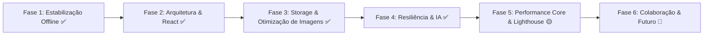

# Roadmap Unificado & Registro Arquitetural — Chef Digital

**Repositório:** wagnergsantos/chef-digital  
**Última Atualização:** 26/08/2026  
**Stack Atual:** React 19 + Vite 5 + Supabase (Database, Auth, Storage, Edge Functions Deno) + PWA Workbox (Offline-First com IndexedDB + LocalStorage).  
**Suíte de Testes:** **103/103 aprovados** (31 suites Vitest) | **Linter:** 0 erros no Oxlint.

---

## 1. Visão Geral do Status das Fases

| Fase | Escopo | Status |
|---|---|:---:|
| **Fase 1 — Estabilização Offline** | IndexedDB (`ChefDigitalDB`), sincronização bidirecional, fallback offline seguro. | 🟢 100% Concluído |
| **Fase 2 — Arquitetura & React 19** | Migração do app legado para componentes React 19, hooks customizados, design tokens. | 🟢 100% Concluído |
| **Fase 3 — Imagens & Storage** | Pipeline WebP client-side, Supabase Storage (`recipe-images`), Workbox `runtimeCaching` (`CacheFirst`), precache < 582 KiB. | 🟢 100% Concluído |
| **Fase 4 — IA, Parser & Resiliência** | Edge Function `parse-recipe` (JSON-LD + Gemini multimodal), circuit breaker, exponential backoff com jitter, contratos em `docs/api-contracts.md`. | 🟢 100% Concluído |
| **Fase 5 — Performance Core & UX Visual** | Metas Lighthouse (LCP < 2.5s, CLS <= 0.10, TTI), code-splitting com `React.lazy()`, queries Supabase sob demanda. | 🟡 Em Progresso |
| **Fase 6 — Colaboração em Tempo Real** | Lista de compras colaborativa (Supabase Realtime) e Web Push Notifications. | 🔮 Futuro |

---

## 2. Entregas & Débitos Técnicos Fechados (Histórico Consolidado)

### 2.1 Imagens, Precache & Storage
- **Otimização e Migração Total (Fases 1, 2 e 3 de Imagens)**:
  - 100% das 127 fotos legadas locais migradas para o Supabase Storage (`recipe-images`) com conversão para WebP.
  - Tabela `receitas` atualizada com URLs do Storage.
  - Binários `public/*.png` removidos do Git (economia de ~11.6 MB).
  - PWA configurado com Workbox `runtimeCaching` (`CacheFirst`, max 200 itens, 30 dias). Precache inicial caiu para **581.67 KiB**.
  - Componente [`src/components/admin/ImageUploadField.jsx`](file:///C:/Sistemas/Projetos/receitas/src/components/admin/ImageUploadField.jsx) com compressão e preview integrado.

### 2.2 Qualidade de Código, Utilitários & Persistência
- **Eliminação de Duplicação**:
  - Módulos compartilhados criados: [`src/constants/categories.js`](file:///C:/Sistemas/Projetos/receitas/src/constants/categories.js) (categorias e normalização), [`src/utils/text.js`](file:///C:/Sistemas/Projetos/receitas/src/utils/text.js) e [`src/utils/units.js`](file:///C:/Sistemas/Projetos/receitas/src/utils/units.js).
- **Camada de Armazenamento**:
  - `StorageRepository` em [`src/logic/storage.js`](file:///C:/Sistemas/Projetos/receitas/src/logic/storage.js) gerenciando LocalStorage de forma defensiva com fallbacks.
  - Poda e limite no histórico de preparo (`cookingHistory` limitado a 20 timestamps por receita e 100 receitas no total).
- **Ambiente de Testes & Linter**:
  - Mock de `localStorage` em [`src/test-setup.js`](file:///C:/Sistemas/Projetos/receitas/src/test-setup.js) zerando todos os warnings de Node.js/JSDOM no Vitest.
  - Configuração do [`.oxlintrc.json`](file:///C:/Sistemas/Projetos/receitas/.oxlintrc.json) com regras de React, hooks, segurança e globals (Deno/Browser/Node).

### 2.3 Resiliência de IA & Backend
- **Edge Function `parse-recipe`**:
  - *Circuit Breaker* com limiar de 5 falhas consecutivas e reabertura gradual (timeout de 30s) em escopo de módulo.
  - *Exponential Backoff* com 30% de jitter para requisições de chave/modelo Gemini.
  - Descarte rápido de modelos 404/503 e fallback em cascata.
  - Documentação formal dos contratos em [`docs/api-contracts.md`](file:///C:/Sistemas/Projetos/receitas/docs/api-contracts.md).

---

## 3. Próximos Passos & Prioridades Ativas

### 🔴 Prioridade Alta — Fase 5: Otimização de Performance da Página Principal
*Spec Detalhada:* [`docs/superpowers/specs/2026-08-25-performance-pagina-principal-design.md`](file:///C:/Sistemas/Projetos/receitas/docs/superpowers/specs/2026-08-25-performance-pagina-principal-design.md)

1. **Code-Splitting de Gavetas e Modais**:
   - Carregar com `React.lazy()` os componentes pesados que não são exibidos no primeiro paint: `PlannerDrawer`, `ShoppingDrawer`, `PantryDrawer`, `RecipeModal` e `CookingMode`.
2. **Query Inicial Rasa (Listagem Rápida)**:
   - Dividir o carregamento do Supabase: buscar apenas metadados necessários para renderizar a grade inicial (`id`, `title`, `emoji`, `image`, `category_id`, `servings`).
   - Carregar listas detalhadas de ingredientes e passos sob demanda ao abrir o modal da receita.
3. **Metas Core Web Vitals (Lighthouse)**:
   - LCP < 2.5s (reduzir dos atuais ~3.2s).
   - CLS <= 0.10 (estabilizar abaixo de 0.10).
   - TTI < 3.0s.

---

### 🟢 Melhorias Funcionais de Produto (Brainstorm 26/08/2026)
*Diferente do restante deste roadmap (que é majoritariamente técnico/performance), este bloco é sobre comportamento e valor de uso direto — ideias que conectam features que já existem no código mas ainda não conversam entre si.*

1. **Lista de Compras Inteligente (desconta a Despensa)**:
   - Hoje `logic/shopping.js` gera a lista consolidada sem consultar `pantryItems` em nenhum momento — a despensa só é usada hoje para filtrar quais receitas dá pra cozinhar agora (`recipeIsFullyStocked`).
   - Proposta: ao gerar a lista de compras/consolidado, itens que já constam na despensa não entram na lista (ou entram numa seção separada "você já tem"). Não exige mudar o modelo de dados da despensa (que hoje é só uma lista de nomes, sem quantidade) — a primeira versão pode ser um match simples por nome normalizado.
2. **Notas Pessoais por Receita**:
   - O app já registra histórico de preparo (`cookingHistory`, exibido como "Preparado 3x (25/08)" no `RecipeModal`) mas não guarda o que o usuário aprendeu naquele preparo.
   - Proposta: campo de texto livre por receita (ex.: "da próxima vez, menos sal", "meu forno esquenta mais, ajustar 10°C pra baixo"). Baixo esforço técnico (uma coluna a mais + textarea no modal/admin), alto valor de uso — é o tipo de ajuste que hoje só existe na cabeça do usuário entre um preparo e outro.
3. **Alerta de Repetição no Planejador Semanal**:
   - Hoje nada avisa se a mesma receita for planejada em dois dias da mesma semana sem querer.
   - Proposta: aviso simples (não bloqueante) tipo "Você já planejou [receita] para terça" ao tentar planejar a mesma receita de novo na mesma semana.
4. **Destaque do Modo Despensa na Home** *(já estava no roadmap, mantido aqui por ser complementar ao item 1 acima)*:
   - Seção ou filtro rápido em destaque na home usando a lógica já testada `recipeIsFullyStocked()` + `pantryItems`, mostrando de cara "o que dá pra cozinhar agora com o que você tem".

---

### 🟡 Prioridade Média — UX & Funcionalidades Complementares
1. **Badge Visual de Fila Offline no Admin**:
   - Exibir no header do Admin o status visual da fila do IndexedDB ("X alterações pendentes de sincronização").
2. **Web Share API na Lista de Compras**:
   - Exportação e compartilhamento direto da lista de compras formatada via WhatsApp / apps nativos do dispositivo.

---

### 🔮 Futuro (Fase 6) — Recursos Colaborativos
1. **Lista de Compras Colaborativa em Tempo Real**:
   - Sincronização multiusuário via Supabase Realtime Channels.
2. **Notificações Push (Web Push)**:
   - Lembretes de planejamento semanal e receitas favoritas via Service Worker e VAPID keys.

---

## 4. Histórico de Avaliações Lighthouse & Vitals

| Data | Performance | Accessibility | Best Practices | SEO | LCP | CLS | TBT | Observações |
|---|---:|---:|---:|---:|---:|---:|---:|---|
| **2026-08-05** | 75 | 95 | 96 | 91 | — | 0.173 | — | Baseline inicial (Vanilla JS) |
| **2026-08-06** | 87 | 100 | 96 | 91 | 2.2s | 0.108 | 10ms | Ajuste LCP-first paint e acessibilidade |
| **2026-08-25** | 83 | 100 | 96 | 91 | 3.2s | 0.122 | 10ms | Pós-migração React (alvo: code-splitting dos modais) |
| **2026-08-26** | — | — | — | — | — | — | — | Precache reduzido para 581 KiB + Storage WebP ativo |
