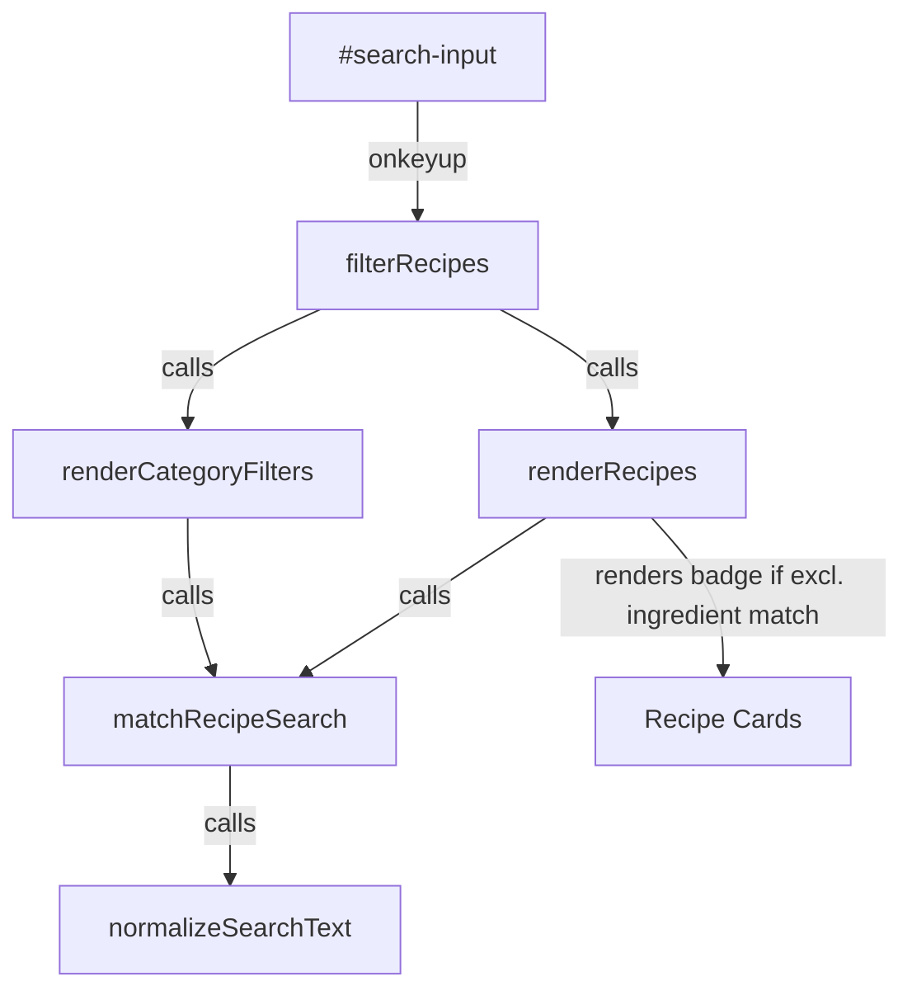

# Busca por Título e Ingrediente Implementation Plan

> **For agentic workers:** REQUIRED SUB-SKILL: Use superpowers:subagent-driven-development to implement this plan task-by-task. Steps use checkbox (`- [ ]`) syntax for tracking.

**Goal:** Extend the search bar to support matching both recipe titles and ingredients with diacritics normalization, displaying a "Contém" badge when matching exclusively via ingredients.

**Architecture:** We will implement two central helper functions, `normalizeSearchText` and `matchRecipeSearch`, in `index.html`. We will update the search input placeholder, refactor `renderCategoryFilters` and `renderRecipes` to use the consolidated matching logic, and inject a visual badge conditionally into the card template with styling defined in `estilos.css`.

**Architecture Diagram:**



**Tech Stack:** Vanilla JavaScript, HTML5, Vanilla CSS, Node.js (for offline unit testing)

**Global Constraints:**
- Accent normalization must use native JS NFD normalize + regex diacritic removal.
- Do not use third-party libraries/npm packages for search or styling.
- Keep style colors compliant with the `DESIGN.md` (no amber for the contains badge).

---

### Task 1: Search Helper Logic (normalizeSearchText & matchRecipeSearch)

**Files:**
- Create: `scratch/test_search.js`
- Modify: `index.html` (lines 315-325)

**Interfaces:**
- Consumes: None
- Produces:
  - `normalizeSearchText(str)` -> string (lowercase, NFD/no accents)
  - `matchRecipeSearch(recipe, rawQuery)` -> `{ matches: boolean, matchedIngredients: string[] }`

- [ ] **Step 1: Write the failing test**

Create the file `scratch/test_search.js` with the following content:
```javascript
const fs = require('fs');
const path = require('path');

// Extract functions from index.html using brace counting
const htmlPath = path.resolve(__dirname, '../index.html');
let content;
try {
    content = fs.readFileSync(htmlPath, 'utf8');
} catch (e) {
    console.error("Could not read index.html");
    process.exit(1);
}

function extractFunction(funcName) {
    const startIdx = content.indexOf(`function ${funcName}`);
    if (startIdx === -1) {
        throw new Error(`Function ${funcName} not found in index.html`);
    }
    const openBraceIdx = content.indexOf('{', startIdx);
    if (openBraceIdx === -1) {
        throw new Error(`Open brace not found for function ${funcName}`);
    }
    let braceCount = 1;
    let i = openBraceIdx + 1;
    while (braceCount > 0 && i < content.length) {
        if (content[i] === '{') {
            braceCount++;
        } else if (content[i] === '}') {
            braceCount--;
        }
        i++;
    }
    return content.substring(openBraceIdx + 1, i - 1);
}

try {
    const normalizeBody = extractFunction('normalizeSearchText');
    const normalizeSearchText = new Function('str', normalizeBody);

    const matchBody = extractFunction('matchRecipeSearch');
    const matchRecipeSearch = new Function('recipe', 'rawQuery', `
        const normalizeSearchText = ${normalizeBody.toString()};
        ${matchBody}
    `);

    console.log("Running tests...");
    
    // Test 1: normalizeSearchText
    const t1 = normalizeSearchText("Pão de Açúcar");
    if (t1 !== "pao de acucar") throw new Error(`Test 1 Failed: expected 'pao de acucar', got '${t1}'`);

    // Test 2: matchRecipeSearch with empty query
    const recipe = {
        title: "Bolo de Cenoura",
        ingredients: [{ name: "Cenoura" }, { name: "Açúcar" }]
    };
    const res2 = matchRecipeSearch(recipe, "");
    if (!res2.matches || res2.matchedIngredients.length !== 0) {
        throw new Error(`Test 2 Failed: expected matches=true, matchedIngredients=[], got matches=${res2.matches}, matchedIngredients=${JSON.stringify(res2.matchedIngredients)}`);
    }

    // Test 3: matchRecipeSearch matching title
    const res3 = matchRecipeSearch(recipe, "Bolo");
    if (!res3.matches || res3.matchedIngredients.length !== 0) {
        throw new Error(`Test 3 Failed: expected matches=true, matchedIngredients=[], got matches=${res3.matches}, matchedIngredients=${JSON.stringify(res3.matchedIngredients)}`);
    }

    // Test 4: matchRecipeSearch matching ingredient
    const res4 = matchRecipeSearch(recipe, "acucar");
    if (!res4.matches || !res4.matchedIngredients.includes("Açúcar")) {
        throw new Error(`Test 4 Failed: expected matches=true, matchedIngredients=['Açúcar'], got matches=${res4.matches}, matchedIngredients=${JSON.stringify(res4.matchedIngredients)}`);
    }

    // Test 5: matchRecipeSearch multiple terms (AND logic)
    const res5 = matchRecipeSearch(recipe, "bolo cenoura acucar");
    if (!res5.matches || !res5.matchedIngredients.includes("Açúcar")) {
        throw new Error(`Test 5 Failed: expected matches=true, matchedIngredients=['Açúcar'], got matches=${res5.matches}, matchedIngredients=${JSON.stringify(res5.matchedIngredients)}`);
    }

    // Test 6: matchRecipeSearch term not found
    const res6 = matchRecipeSearch(recipe, "frango");
    if (res6.matches) {
        throw new Error(`Test 6 Failed: expected matches=false, got matches=true`);
    }

    console.log("All tests passed successfully!");
} catch (err) {
    console.error("Test execution failed:", err.message);
    process.exit(1);
}
```

- [ ] **Step 2: Run test to verify it fails**

Run: `node scratch/test_search.js`
Expected output: Fails with message `Function normalizeSearchText not found in index.html`

- [ ] **Step 3: Write minimal implementation**

Add the helper functions to `index.html` right after `escapeHtml` function (around line 324).
```javascript
        function normalizeSearchText(str) {
            return (str || '').toString().toLowerCase()
                .normalize('NFD').replace(/[\u0300-\u036f]/g, '');
        }

        function matchRecipeSearch(recipe, rawQuery) {
            const terms = normalizeSearchText(rawQuery).split(/\s+/).filter(Boolean);
            if (terms.length === 0) return { matches: true, matchedIngredients: [] };

            const normTitle = normalizeSearchText(recipe.title);
            const matchedIngredients = [];

            const allTermsMatch = terms.every(term => {
                if (normTitle.includes(term)) return true;
                const hitIngredient = recipe.ingredients.find(ing =>
                    normalizeSearchText(ing.name).includes(term));
                if (hitIngredient) {
                    if (!matchedIngredients.includes(hitIngredient.name)) {
                        matchedIngredients.push(hitIngredient.name);
                    }
                    return true;
                }
                return false;
            });

            return { matches: allTermsMatch, matchedIngredients: allTermsMatch ? matchedIngredients : [] };
        }
```

- [ ] **Step 4: Run test to verify it passes**

Run: `node scratch/test_search.js`
Expected output: `All tests passed successfully!`

- [ ] **Step 5: Commit**

```bash
git add index.html scratch/test_search.js
git commit -m "feat: add normalizeSearchText and matchRecipeSearch helpers"
```

---

### Task 2: Integrate search logic in index.html

**Files:**
- Modify: `index.html` (search input placeholder/aria, `renderCategoryFilters`, `renderRecipes` filter)

**Interfaces:**
- Consumes:
  - `matchRecipeSearch(recipe, rawQuery)`
- Produces:
  - Consistent category totals and recipe cards list based on query.

- [ ] **Step 1: Write the failing test**

There is no automated browser test suite. Open the browser manually to `index.html` and verify the current behavior of searching by ingredient (e.g. searching "cebola" should NOT filter by cebola ingredient).

- [ ] **Step 2: Run test to verify it fails**

Type "cebola" in the search input in the browser.
Expected: Recipe count drops to 0 or only shows recipes with "cebola" in the title.

- [ ] **Step 3: Write minimal implementation**

Modify `index.html` in three places:
1. Update `#search-input` input attributes:
```diff
-                        <input type="text" id="search-input" onkeyup="filterRecipes()" placeholder="Buscar por título..." class="search-input" aria-label="Buscar receitas por título">
+                        <input type="text" id="search-input" onkeyup="filterRecipes()" placeholder="Buscar por título ou ingrediente..." class="search-input" aria-label="Buscar receitas por título ou ingrediente">
```

2. Replace the search match check inside `renderCategoryFilters()` counts:
```diff
                 if (key === 'todos') {
                     count = recipes.filter(r => {
-                        const searchMatch = !searchQuery || 
-                            r.title.toLowerCase().includes(searchQuery);
+                        const searchMatch = matchRecipeSearch(r, searchQuery).matches;
                         const favoriteMatch = !showFavoritesOnly || favorites.includes(r.id);
                         return searchMatch && favoriteMatch;
                     }).length;
                 } else {
                     count = recipes.filter(r => {
                         let categoryMatch = false;
                         if (Array.isArray(r.category)) {
                             categoryMatch = r.category.includes(key);
                         } else {
                             categoryMatch = r.category === key;
                         }
-                        const searchMatch = !searchQuery || 
-                            r.title.toLowerCase().includes(searchQuery);
+                        const searchMatch = matchRecipeSearch(r, searchQuery).matches;
                         const favoriteMatch = !showFavoritesOnly || favorites.includes(r.id);
                         return categoryMatch && searchMatch && favoriteMatch;
                     }).length;
                 }
```

3. Replace the search match check inside `renderRecipes()` filter:
```diff
                 // Search Match (Check Title only)
-                const searchMatch = !searchQuery || 
-                    recipe.title.toLowerCase().includes(searchQuery);
+                const searchMatch = matchRecipeSearch(recipe, searchQuery).matches;
```

- [ ] **Step 4: Run test to verify it passes**

Refresh `index.html` in the browser and perform manual tests:
1. Search "cebola": Recipes with Cebola ingredient but not in the title should appear.
2. Search "frango batata": Recipes with both elements should appear.
3. Category count badges beside each category in sidebar should reflect the updated ingredient search count correctly.

- [ ] **Step 5: Commit**

```bash
git add index.html
git commit -m "feat: integrate search by ingredient in recipes and category filters"
```

---

### Task 3: Visual Badge for Ingredient Search Match

**Files:**
- Modify: `index.html` (card template in `renderRecipes`), `estilos.css`

**Interfaces:**
- Consumes:
  - `matchRecipeSearch(recipe, rawQuery).matchedIngredients`
- Produces:
  - `.card-search-match` CSS rule in `estilos.css`
  - Dynamic `<p class="card-search-match">` markup in recipe cards.

- [ ] **Step 1: Write the failing test**

Search "cebola" in the browser.
Expected: Recipe cards appear, but NO badge indicating "🔍 Contém: Cebola" is shown.

- [ ] **Step 2: Run test to verify it fails**

Confirm Cebola recipes are shown, but search match badge is missing.

- [ ] **Step 3: Write minimal implementation**

1. In `estilos.css`, append the CSS style rule under `.card-title` styles:
```css
.card-search-match {
    font-size: 11px;
    color: var(--text-muted);
    font-weight: 500;
    margin-top: 4px;
}
```

2. In `index.html` inside `renderRecipes()`, calculate the search matches inside the `forEach` loop and append the paragraph under `.card-title`:
```javascript
                filtered.forEach((recipe, index) => {
                    const isFav = favorites.includes(recipe.id);
                    const isPlanned = plannedRecipes.some(p => p.id === recipe.id);
                    const { matchedIngredients } = matchRecipeSearch(recipe, searchQuery);
                    const card = document.createElement('div');
                    // ...
```
And inside `card.innerHTML`:
```html
                        <div class="card-body">
                            <div class="card-info">
                                <span class="card-source">${escapeHtml(recipe.source || '')}</span>
                                <h4 class="card-title">${escapeHtml(recipe.title)}</h4>
                                ${matchedIngredients && matchedIngredients.length > 0 ? `<p class="card-search-match">🔍 Contém: ${escapeHtml(matchedIngredients.join(', '))}</p>` : ''}
                            </div>
```

- [ ] **Step 4: Run test to verify it passes**

Refresh the page and search:
1. Search "cebola": Verify the "🔍 Contém: Cebola" badge is visible on Cebola-containing recipe cards.
2. Search "bolo": Verify that since "Bolo" matches the title of "Bolo de Cenoura", no badge is shown on that card.
3. Verify that removing/clearing the query makes the badge disappear.

- [ ] **Step 5: Commit**

```bash
git add estilos.css index.html
git commit -m "feat: add contains badge on ingredient match"
```
