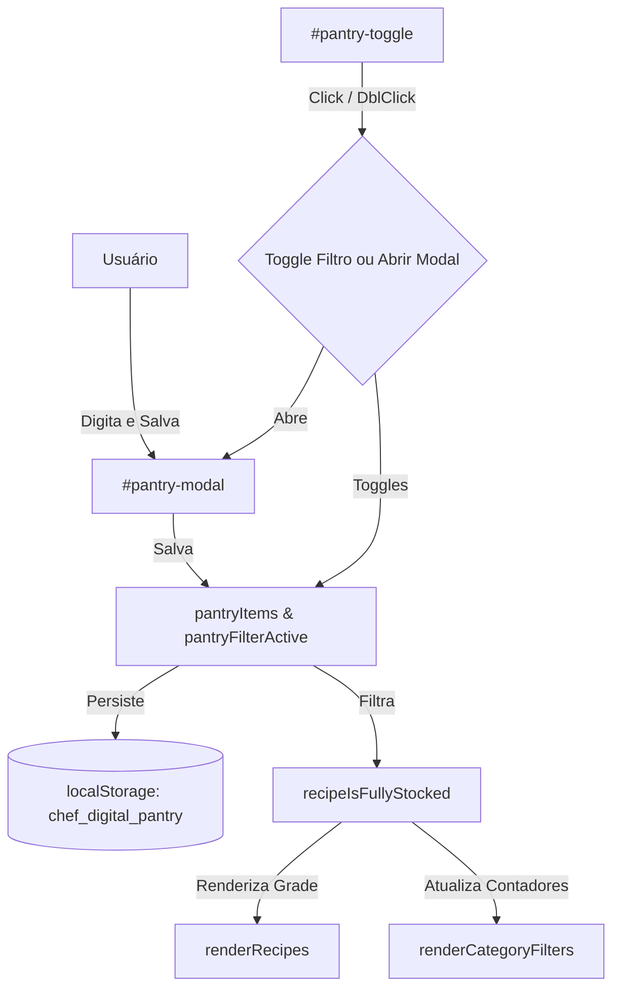

# Despensa (Filtro "Posso Fazer com o que Tenho") Implementation Plan

> **For agentic workers:** REQUIRED SUB-SKILL: Use superpowers:subagent-driven-development to implement this plan task-by-task. Steps use checkbox (`- [ ]`) syntax for tracking.

**Goal:** Implementar o filtro de despensa que permite ao usuário informar seus ingredientes disponíveis em casa, salvando-os no `localStorage` e exibindo um selo "✅ Você tem tudo" nos cards das receitas que podem ser totalmente preparadas com o estoque atual.

**Architecture:** Adicionaremos o estado global para a lista de ingredientes (`pantryItems`) e o estado ativo do filtro (`pantryFilterActive`) em [index.html](file:///C:/Sistemas/Projetos/receitas/index.html). A lógica de matching será implementada na função `recipeIsFullyStocked(recipe)`. Um novo botão no cabeçalho abrirá um modal (`pantry-modal`) contendo um `<textarea>` para entrada livre de texto. O filtro será integrado ao método de filtragem de cards, contadores de categorias e botão de limpar filtros. A estilização será adicionada em [estilos.css](file:///C:/Sistemas/Projetos/receitas/estilos.css).

**Architecture Diagram:**



**Tech Stack:** Vanilla JavaScript (ES6+), HTML5, Vanilla CSS, Node.js (para testes unitários)

## Global Constraints
- A checagem de match deve usar a função `normalizeSearchText` para comparação de substrings normalizada e sem acentos.
- Ingredientes com unidade "a gosto" ou "opcional" não devem impedir o match (são considerados sempre em estoque).
- Apenas CSS vanilla e JS puro são permitidos (sem bibliotecas externas).
- As cores de destaque do selo e botão ativo devem respeitar o padrão do `DESIGN.md` (família `--success` verde).
- Implementar acessibilidade completa no modal (focus trap e fechamento via tecla ESC).

---

### Task 1: Business Logic and Unit Testing

**Files:**
- Create: [test_despensa.js](file:///C:/Sistemas/Projetos/receitas/scratch/test_despensa.js)
- Modify: [index.html](file:///C:/Sistemas/Projetos/receitas/index.html) (Adicionar `recipeIsFullyStocked`)

**Interfaces:**
- Consumes: [normalizeSearchText](file:///C:/Sistemas/Projetos/receitas/index.html#L378)
- Produces:
  - `recipeIsFullyStocked(recipe)` -> boolean

- [ ] **Step 1: Write the failing test**

Crie o arquivo [test_despensa.js](file:///C:/Sistemas/Projetos/receitas/scratch/test_despensa.js) com testes unitários para a lógica de validação:

```javascript
const fs = require('fs');
const path = require('path');

const htmlPath = path.resolve(__dirname, '../index.html');
let content;
try {
    content = fs.readFileSync(htmlPath, 'utf8');
} catch (e) {
    console.error("Could not read index.html");
    process.exit(1);
}

function extractFunction(funcName) {
    const startIdx = content.indexOf(`function ${funcName}`);
    if (startIdx === -1) {
        throw new Error(`Function ${funcName} not found in index.html`);
    }
    const openBraceIdx = content.indexOf('{', startIdx);
    if (openBraceIdx === -1) {
        throw new Error(`Open brace not found for function ${funcName}`);
    }
    let braceCount = 1;
    let i = openBraceIdx + 1;
    while (braceCount > 0 && i < content.length) {
        if (content[i] === '{') {
            braceCount++;
        } else if (content[i] === '}') {
            braceCount--;
        }
        i++;
    }
    return content.substring(openBraceIdx + 1, i - 1);
}

try {
    const normalizeBody = extractFunction('normalizeSearchText');
    const recipeIsFullyStockedBody = extractFunction('recipeIsFullyStocked');

    const recipeIsFullyStocked = new Function('recipe', `
        const normalizeSearchText = ${normalizeBody.toString()};
        ${recipeIsFullyStockedBody}
    `);

    console.log("Running Despensa Logic tests...");

    // Test 1: Empty pantryItems
    global.pantryItems = [];
    const r1 = { ingredients: [{ name: "arroz", unit: "g" }] };
    const res1 = recipeIsFullyStocked(r1);
    if (res1 !== false) throw new Error("Test 1 Failed: empty pantry should return false");

    // Test 2: All ingredients match exactly
    global.pantryItems = ["arroz", "feijao"];
    const r2 = { ingredients: [{ name: "Arroz", unit: "g" }, { name: "feijão", unit: "g" }] };
    const res2 = recipeIsFullyStocked(r2);
    if (res2 !== true) throw new Error("Test 2 Failed: exact matches should return true");

    // Test 3: Some ingredients missing
    global.pantryItems = ["arroz"];
    const r3 = { ingredients: [{ name: "arroz", unit: "g" }, { name: "feijão", unit: "g" }] };
    const res3 = recipeIsFullyStocked(r3);
    if (res3 !== false) throw new Error("Test 3 Failed: missing ingredient should return false");

    // Test 4: Accent and case normalization
    global.pantryItems = ["pao de acucar", "CEBOLA"];
    const r4 = { ingredients: [{ name: "Pão de Açúcar", unit: "unidade" }, { name: "cebola", unit: "g" }] };
    const res4 = recipeIsFullyStocked(r4);
    if (res4 !== true) throw new Error("Test 4 Failed: normalized match should return true");

    // Test 5: "a gosto" or "opcional" ingredients always count as available
    global.pantryItems = ["arroz"];
    const r5 = { ingredients: [{ name: "arroz", unit: "g" }, { name: "sal", unit: "a gosto" }, { name: "azeite", unit: "opcional" }] };
    const res5 = recipeIsFullyStocked(r5);
    if (res5 !== true) throw new Error("Test 5 Failed: 'a gosto'/'opcional' should not prevent matching");

    // Test 6: Bidirectional substring matching
    global.pantryItems = ["frango", "cebola picada"];
    const r6 = { ingredients: [{ name: "peito de frango", unit: "g" }, { name: "cebola", unit: "g" }] };
    const res6 = recipeIsFullyStocked(r6);
    if (res6 !== true) throw new Error("Test 6 Failed: substring bidirecional matching should return true");

    console.log("All Despensa Logic tests passed successfully!");
} catch (err) {
    console.error("Test execution failed:", err.message);
    process.exit(1);
}
```

- [ ] **Step 2: Run test to verify it fails**

Execute:
```bash
node scratch/test_despensa.js
```
Esperado: Falha indicando que a função `recipeIsFullyStocked` não foi encontrada no `index.html`.

- [ ] **Step 3: Write minimal implementation**

Adicione a função `recipeIsFullyStocked` em [index.html](file:///C:/Sistemas/Projetos/receitas/index.html) logo após a função `normalizeSearchText` (por volta da linha 382):

```javascript
        function recipeIsFullyStocked(recipe) {
            if (!pantryItems || pantryItems.length === 0) return false;
            const normPantry = pantryItems.map(normalizeSearchText);
            return recipe.ingredients.every(ing => {
                const unit = (ing.unit || '').toLowerCase();
                if (unit.includes('a gosto') || unit.includes('opcional')) return true;
                const normIng = normalizeSearchText(ing.name);
                return normPantry.some(p => normIng.includes(p) || p.includes(normIng));
            });
        }
```

- [ ] **Step 4: Run test to verify it passes**

Execute novamente:
```bash
node scratch/test_despensa.js
```
Esperado: Exibe "All Despensa Logic tests passed successfully!".

- [ ] **Step 5: Commit**

```bash
git add index.html scratch/test_despensa.js
git commit -m "feat(pantry): add recipeIsFullyStocked matching logic and unit tests"
```

---

### Task 2: State, LocalStorage, and DOM/Event Setup

**Files:**
- Modify: [index.html](file:///C:/Sistemas/Projetos/receitas/index.html)

**Interfaces:**
- Consumes: None
- Produces:
  - `pantryItems` global array
  - `pantryFilterActive` global boolean
  - `openPantryModal()`
  - `closePantryModal()`
  - `saveAndFilterPantry()`
  - `clearPantry()`
  - `togglePantryFilterOrOpenModal(event)`

- [ ] **Step 1: Write the failing test**

Atualize o arquivo [test_despensa.js](file:///C:/Sistemas/Projetos/receitas/scratch/test_despensa.js) para verificar se as variáveis de estado e funções globais estão expostas no escopo global ou em funções válidas de `index.html`.

Adicione o seguinte ao final do bloco `try` de `scratch/test_despensa.js`:
```javascript
    // Verify initialization syntax matches and functions exist
    const hasPantryItemsVar = content.includes('let pantryItems');
    const hasPantryActiveVar = content.includes('let pantryFilterActive');
    
    if (!hasPantryItemsVar || !hasPantryActiveVar) {
        throw new Error("Missing global state declarations for pantryItems or pantryFilterActive");
    }
    
    extractFunction('openPantryModal');
    extractFunction('closePantryModal');
    extractFunction('saveAndFilterPantry');
    extractFunction('clearPantry');
    extractFunction('togglePantryFilterOrOpenModal');
    
    console.log("DOM bindings and scripts validated!");
```

- [ ] **Step 2: Run test to verify it fails**

Execute:
```bash
node scratch/test_despensa.js
```
Esperado: Falha indicando que as variáveis globais ou funções como `openPantryModal` não foram declaradas.

- [ ] **Step 3: Write minimal implementation**

1. Declare as variáveis de estado globais em [index.html](file:///C:/Sistemas/Projetos/receitas/index.html) por volta da linha 326 (abaixo de `showFavoritesOnly`):
```javascript
        let pantryItems = [];
        let pantryFilterActive = false;
```

2. Carregue o estado persistido em `window.onload` (por volta da linha 420):
```javascript
                try {
                    pantryItems = JSON.parse(localStorage.getItem('chef_digital_pantry')) || [];
                } catch (e) {
                    pantryItems = [];
                }
```

3. Adicione o botão no cabeçalho em [index.html](file:///C:/Sistemas/Projetos/receitas/index.html) (abaixo do botão de favoritos `#favs-toggle`, por volta da linha 70):
```html
                <!-- Pantry Toggle Button -->
                <button id="pantry-toggle" onclick="togglePantryFilterOrOpenModal(event)" ondblclick="openPantryModal()" class="control-btn btn-pantry" title="Filtrar por Despensa (Duplo clique para editar)" aria-label="Filtrar por ingredientes da despensa">
                    <svg xmlns="http://www.w3.org/2000/svg" fill="none" viewBox="0 0 24 24" stroke="currentColor" stroke-width="2" aria-hidden="true">
                        <path stroke-linecap="round" stroke-linejoin="round" d="M5 4h14a2 2 0 0 1 2 2v12a2 2 0 0 1-2 2H5a2 2 0 0 1-2-2V6a2 2 0 0 1 2-2zm0 8h14M9 8h6M9 16h6" />
                    </svg>
                </button>
```

4. Adicione o modal da despensa [index.html](file:///C:/Sistemas/Projetos/receitas/index.html) (abaixo do modal de receitas `#recipe-modal`, por volta da linha 285):
```html
    <!-- Pantry Modal -->
    <div id="pantry-modal" class="modal-overlay" onclick="closePantryModalOnBackdrop(event)" role="dialog" aria-modal="true" aria-labelledby="pantry-modal-title">
        <div class="modal-container" id="pantry-modal-content" style="max-width: 500px;">
            <div class="modal-header-banner">
                <button onclick="closePantryModal()" class="modal-close-btn" title="Fechar" aria-label="Fechar despensa">
                    <svg xmlns="http://www.w3.org/2000/svg" viewBox="0 0 20 20" fill="currentColor" aria-hidden="true">
                        <path fill-rule="evenodd" d="M4.293 4.293a1 1 0 011.414 0L10 8.586l4.293-4.293a1 1 0 111.414 1.414L11.414 10l4.293 4.293a1 1 0 01-1.414 1.414L10 11.414l-4.293 4.293a1 1 0 01-1.414-1.414L8.586 10 4.293 5.707a1 1 0 010-1.414z" clip-rule="evenodd" />
                    </svg>
                </button>
                <div class="modal-badges">
                    <span class="modal-badge-cat">Despensa</span>
                </div>
                <h3 id="pantry-modal-title" class="serif-title">Ingredientes da Despensa</h3>
            </div>
            
            <div class="modal-body pantry-modal-body">
                <p class="pantry-modal-help">Insira os ingredientes que você tem em casa (um por linha ou separados por vírgula). O app destacará as receitas que você tem todos os ingredientes.</p>
                <textarea id="pantry-textarea" placeholder="Ex: frango, cebola, arroz, alho..." aria-label="Ingredientes da despensa"></textarea>
                
                <div class="pantry-actions">
                    <button onclick="clearPantry()" class="btn-modal-action btn-modal-clear" title="Limpar todos os ingredientes">
                        <svg xmlns="http://www.w3.org/2000/svg" fill="none" viewBox="0 0 24 24" stroke="currentColor" stroke-width="2" aria-hidden="true">
                            <path stroke-linecap="round" stroke-linejoin="round" d="M19 7l-.867 12.142A2 2 0 0116.138 21H7.862a2 2 0 01-1.995-1.858L5 7m5 4v6m4-6v6m1-10V4a1 1 0 00-1-1h-4a1 1 0 00-1 1v3M4 7h16" />
                        </svg>
                        <span>Limpar</span>
                    </button>
                    <button onclick="saveAndFilterPantry()" class="btn-modal-action btn-modal-action-planner" title="Salvar e aplicar filtro de despensa">
                        <svg xmlns="http://www.w3.org/2000/svg" fill="none" viewBox="0 0 24 24" stroke="currentColor" stroke-width="2" aria-hidden="true">
                            <path stroke-linecap="round" stroke-linejoin="round" d="M5 13l4 4L19 7" />
                        </svg>
                        <span>Salvar e Filtrar</span>
                    </button>
                </div>
            </div>
        </div>
    </div>
```

5. Adicione as funções no final do script em [index.html](file:///C:/Sistemas/Projetos/receitas/index.html) (antes do fechamento do `<script>`, por volta da linha 1378):
```javascript
        function openPantryModal() {
            const modal = document.getElementById('pantry-modal');
            const textarea = document.getElementById('pantry-textarea');
            if (modal) {
                if (textarea) {
                    textarea.value = pantryItems.join('\n');
                }
                previouslyFocusedElement = document.activeElement;
                modal.classList.add('open');
                setTimeout(() => {
                    if (textarea) textarea.focus();
                }, 100);
            }
        }

        function closePantryModal() {
            const modal = document.getElementById('pantry-modal');
            if (modal) {
                modal.classList.remove('open');
            }
            if (previouslyFocusedElement) {
                previouslyFocusedElement.focus();
                previouslyFocusedElement = null;
            }
        }

        function closePantryModalOnBackdrop(e) {
            if (e.target.id === 'pantry-modal') {
                closePantryModal();
            }
        }

        function saveAndFilterPantry() {
            const textarea = document.getElementById('pantry-textarea');
            if (textarea) {
                pantryItems = textarea.value.split(/[\n,]/).map(s => s.trim()).filter(Boolean);
                localStorage.setItem('chef_digital_pantry', JSON.stringify(pantryItems));
            }
            pantryFilterActive = true;
            
            const btn = document.getElementById('pantry-toggle');
            if (btn) {
                btn.classList.add('active');
            }
            
            closePantryModal();
            renderRecipes();
            showToast('Ingredientes salvos e filtro aplicado!');
        }

        function clearPantry() {
            const textarea = document.getElementById('pantry-textarea');
            if (textarea) {
                textarea.value = '';
            }
            pantryItems = [];
            localStorage.setItem('chef_digital_pantry', JSON.stringify([]));
            showToast('Despensa limpa!');
        }

        function togglePantryFilterOrOpenModal(event) {
            if (pantryItems.length === 0) {
                openPantryModal();
            } else {
                pantryFilterActive = !pantryFilterActive;
                const btn = document.getElementById('pantry-toggle');
                if (btn) {
                    if (pantryFilterActive) {
                        btn.classList.add('active');
                    } else {
                        btn.classList.remove('active');
                    }
                }
                renderRecipes();
            }
        }
```

6. Adicione o listener do ESC e trapFocus no listener do keydown global (por volta da linha 790):
```javascript
        // No listener keydown existente:
        document.addEventListener('keydown', function(e) {
            const modal = document.getElementById('recipe-modal');
            const pantryModal = document.getElementById('pantry-modal');
            const planner = document.getElementById('planner-drawer');
            const shopping = document.getElementById('shopping-list-drawer');

            if (e.key === 'Escape' || e.keyCode === 27) {
                if (modal.classList.contains('open')) {
                    closeRecipeModal();
                } else if (pantryModal && pantryModal.classList.contains('open')) {
                    closePantryModal();
                } else if (planner.classList.contains('open') || shopping.classList.contains('open')) {
                    closeAllDrawers();
                }
            }

            if (modal.classList.contains('open')) {
                trapFocus(e, 'recipe-modal-content');
            } else if (pantryModal && pantryModal.classList.contains('open')) {
                trapFocus(e, 'pantry-modal-content');
            } else if (planner.classList.contains('open')) {
                trapFocus(e, 'planner-drawer');
            } else if (shopping.classList.contains('open')) {
                trapFocus(e, 'shopping-list-drawer');
            }
        });
```

- [ ] **Step 4: Run test to verify it passes**

Execute:
```bash
node scratch/test_despensa.js
```
Esperado: Exibe "DOM bindings and scripts validated!" e sucesso nos testes.

- [ ] **Step 5: Commit**

```bash
git add index.html
git commit -m "feat(pantry): expose states, create DOM elements, and modal controllers"
```

---

### Task 3: Filter Integration and Card Badge Rendering

**Files:**
- Modify: [index.html](file:///C:/Sistemas/Projetos/receitas/index.html)

**Interfaces:**
- Consumes: `pantryFilterActive` and `recipeIsFullyStocked()`
- Produces: None (UI interaction update)

- [ ] **Step 1: Write the failing test**

(Não se aplica a testes automatizados simples, pois envolve renderização visual e contagens interativas baseadas na interface DOM. Avançar direto para a implementação del passo 3).

- [ ] **Step 2: Run test to verify it fails**

(Avançar direto).

- [ ] **Step 3: Write minimal implementation**

1. Atualizar a filtragem em `renderRecipes` em [index.html](file:///C:/Sistemas/Projetos/receitas/index.html) (por volta da linha 608):
```diff
             let filtered = recipes.filter(recipe => {
                 // Category Filter supporting both string and array multitags
                 let categoryMatch = false;
                 if (activeCategory === 'todos') {
                     categoryMatch = true;
                 } else {
                     if (Array.isArray(recipe.category)) {
                         categoryMatch = recipe.category.includes(activeCategory);
                     } else {
                         categoryMatch = recipe.category === activeCategory;
                     }
                 }
                 
                 // Search Match (Check Title only)
                 const searchMatch = matchRecipeSearch(recipe, searchQuery).matches;
 
                 // Favorites Filter
                 const favoriteMatch = !showFavoritesOnly || favorites.includes(recipe.id);
 
-                return categoryMatch && searchMatch && favoriteMatch;
+                // Pantry Filter
+                const pantryMatch = !pantryFilterActive || recipeIsFullyStocked(recipe);
+
+                return categoryMatch && searchMatch && favoriteMatch && pantryMatch;
             });
```

2. Renderizar o selo "✅ Você tem tudo" no card em `renderRecipes` (por volta da linha 660):
```javascript
                    const isFav = favorites.includes(recipe.id);
                    const isPlanned = plannedRecipes.some(p => p.id === recipe.id);
                    const isFullyStocked = pantryFilterActive && recipeIsFullyStocked(recipe);
                    const pantryBadge = isFullyStocked ? '<span class="card-badge pantry-badge">✅ Você tem tudo</span>' : '';
                    const { matchedIngredients } = matchRecipeSearch(recipe, searchQuery);
```
E injetar `${pantryBadge}` abaixo do badge de planejamento (por volta da linha 690):
```html
                            <div class="card-badges-wrapper">
                                ${isPlanned ? '<span class="card-badge planned-badge">Planejado</span>' : ''}
                                ${pantryBadge}
                                ${categoryBadges}
                            </div>
```

3. Atualizar os contadores de categoria em `renderCategoryFilters` (por volta da linha 477):
```javascript
                let count = 0;
                const pantryMatch = (r) => !pantryFilterActive || recipeIsFullyStocked(r);
                if (key === 'todos') {
                    count = recipes.filter(r => {
                        const searchMatch = matchRecipeSearch(r, searchQuery).matches;
                        const favoriteMatch = !showFavoritesOnly || favorites.includes(r.id);
                        return searchMatch && favoriteMatch && pantryMatch(r);
                    }).length;
                } else {
                    count = recipes.filter(r => {
                        let categoryMatch = false;
                        if (Array.isArray(r.category)) {
                            categoryMatch = r.category.includes(key);
                        } else {
                            categoryMatch = r.category === key;
                        }
                        const searchMatch = matchRecipeSearch(r, searchQuery).matches;
                        const favoriteMatch = !showFavoritesOnly || favorites.includes(r.id);
                        return categoryMatch && searchMatch && favoriteMatch && pantryMatch(r);
                    }).length;
                }
```

4. Integrar o filtro com "Limpar filtros" em `updateClearFiltersBtnVisibility` e `clearAllFilters()` (por volta da linha 562):
```javascript
        // Helper to update the visibility of Clear Filters button
        function updateClearFiltersBtnVisibility() {
            const clearFiltersBtn = document.getElementById('clear-filters-btn');
            if (!clearFiltersBtn) return;
            
            const hasActiveFilters = (searchQuery.length > 0) || 
                                     (activeCategory !== 'todos') || 
                                     showFavoritesOnly ||
                                     pantryFilterActive;
                                     
            if (hasActiveFilters) {
                clearFiltersBtn.classList.remove('hidden');
            } else {
                clearFiltersBtn.classList.add('hidden');
            }
        }

        // Clear all filters action
        function clearAllFilters() {
            // Clear search
            const input = document.getElementById('search-input');
            if (input) input.value = '';
            searchQuery = '';
            const clearBtn = document.getElementById('search-clear-btn');
            if (clearBtn) {
                clearBtn.classList.add('hidden');
            }

            // Clear active category
            activeCategory = 'todos';

            // Clear favorites filter
            showFavoritesOnly = false;
            const favsBtn = document.getElementById('favs-toggle');
            if (favsBtn) {
                favsBtn.classList.remove('active');
            }

            // Clear pantry filter
            pantryFilterActive = false;
            const pantryBtn = document.getElementById('pantry-toggle');
            if (pantryBtn) {
                pantryBtn.classList.remove('active');
            }

            // Re-render
            renderRecipes();
        }
```

- [ ] **Step 4: Run test to verify it passes**

Execute `node scratch/test_despensa.js` para garantir que as alterações não introduziram erros de sintaxe ou de importação de funções.
Esperado: PASS

- [ ] **Step 5: Commit**

```bash
git add index.html
git commit -m "feat(pantry): integrate pantry filter into layout and card badges"
```

---

### Task 4: CSS Styles for the Pantry Controls

**Files:**
- Modify: [estilos.css](file:///C:/Sistemas/Projetos/receitas/estilos.css)

**Interfaces:**
- Consumes: None
- Produces: CSS classes: `.control-btn.btn-pantry`, `.pantry-modal-body`, `.pantry-modal-help`, `#pantry-textarea`, `.pantry-actions`, `.btn-modal-clear`, `.card-badge.pantry-badge`

- [ ] **Step 1: Write the failing test**

(Não se aplica a estilos CSS).

- [ ] **Step 2: Run test to verify it fails**

(Avançar direto).

- [ ] **Step 3: Write minimal implementation**

Adicione as regras de estilização ao final de [estilos.css](file:///C:/Sistemas/Projetos/receitas/estilos.css):

```css
/* Pantry Button Theme states */
.control-btn.btn-pantry.active {
    color: var(--success-hover);
    background-color: var(--success-light);
}

.control-btn.btn-pantry:hover {
    color: var(--success-hover);
    background-color: var(--success-light);
}

/* Pantry Modal Container Layout */
.pantry-modal-body {
    display: flex;
    flex-direction: column;
    gap: 16px;
    padding: 24px;
}

.pantry-modal-help {
    font-size: 14px;
    color: var(--text-muted);
    line-height: 1.5;
}

/* Textarea input styles matching theme tokens */
#pantry-textarea {
    width: 100%;
    height: 180px;
    padding: 12px 16px;
    border: 1px solid var(--border-dark);
    border-radius: var(--radius-md);
    font-family: var(--font-body);
    font-size: 14px;
    color: var(--text-main);
    background-color: var(--bg-main);
    resize: vertical;
    transition: border-color var(--transition-fast), box-shadow var(--transition-fast);
}

#pantry-textarea:focus {
    outline: none;
    border-color: var(--primary-color);
    box-shadow: 0 0 0 3px var(--primary-light-border);
}

/* Modal Actions Layout */
.pantry-actions {
    display: flex;
    justify-content: flex-end;
    gap: 12px;
    margin-top: 8px;
}

.btn-modal-clear {
    background-color: var(--danger-light);
    color: var(--danger-hover);
}

.btn-modal-clear:hover {
    background-color: var(--danger-hover);
    color: var(--text-white);
}

/* Card pantry badge style */
.card-badge.pantry-badge {
    background-color: var(--success-light);
    color: var(--success-hover);
    border-color: var(--success-light-border);
}
```

- [ ] **Step 4: Run test to verify it passes**

Inicie o servidor de desenvolvimento (ou abra o `index.html` localmente) e teste:
1. Digite ingredientes separados por vírgula no modal, clique em "Salvar e Filtrar".
2. Certifique-se de que os cards de receitas que você pode fazer ganham o badge verde "✅ Você tem tudo".
3. Verifique o visual em tema claro e escuro.

- [ ] **Step 5: Commit**

```bash
git add estilos.css
git commit -m "style(pantry): add styles for pantry button, modal textarea and card badges"
```

---

### Task 5: Clean up Scratch Files

**Files:**
- Modify: Delete: `scratch/test_despensa.js` (or keep as verification script)

- [ ] **Step 1: Cleanup test file**

Remova o arquivo temporário de testes para manter a árvore de diretórios limpa.
```bash
rm scratch/test_despensa.js
```

- [ ] **Step 2: Commit**

```bash
git commit -am "chore(pantry): remove temporary unit test file"
```
