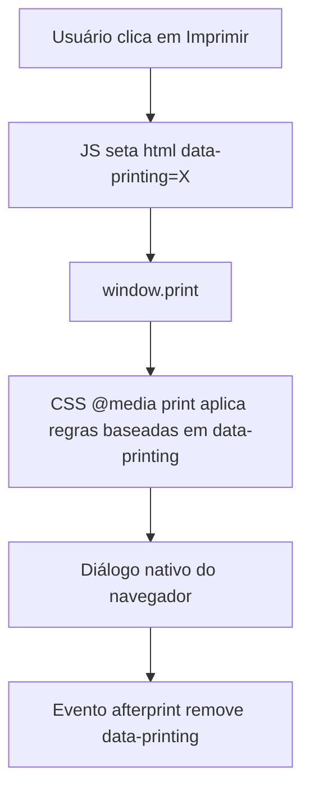

# Impressão (Receita, Lista de Compras e Menu Semanal) Implementation Plan

> **For agentic workers:** REQUIRED SUB-SKILL: Use superpowers:subagent-driven-development to implement this plan task-by-task. Steps use checkbox (`- [ ]`) syntax for tracking.

**Goal:** Implementar impressão nativa (`window.print()`) para a receita aberta no modal, a lista de compras e o menu semanal, reaproveitando o DOM já renderizado de cada tela, sempre em paleta clara e sem os botões de ação/navegação.

**Spec:** [2026-07-27-impressao-design.md](file:///C:/Sistemas/Projetos/receitas/docs/superpowers/specs/2026-07-27-impressao-design.md)

**Architecture:** Um atributo `data-printing` em `<html>` (`"recipe"` | `"shopping"` | `"planner"`) é setado por três funções JS novas (`printRecipe`, `printShoppingList`, `printPlanner`) logo antes de chamar `window.print()`, e removido por um único listener de `afterprint`. Um bloco `@media print` novo em [estilos.css](file:///C:/Sistemas/Projetos/receitas/estilos.css) usa esse atributo para: (1) esconder todo o resto da página, (2) neutralizar `opacity`/`transform`/`position: fixed` que normalmente escondem o modal/drawer fechado, (3) forçar paleta clara sobrescrevendo as variáveis de cor reais do projeto (`--bg-main`, `--bg-card`, `--text-main`, `--text-muted`, `--border-color` — **não** `--neutral-*` como no rascunho da spec, que usa nomes que não existem no CSS atual), e (4) esconder botões de ação. Nenhuma nova função de renderização é criada.

**Architecture Diagram:**



**Tech Stack:** Vanilla JavaScript (ES6+), HTML5, Vanilla CSS. Sem dependências externas, sem test runner automatizado (validação manual via checklist).

## Global Constraints
- Não gerar HTML novo em janela/aba separada — a impressão reaproveita o DOM existente do modal/drawer (in-place).
- Não introduzir bibliotecas de impressão/PDF; usar apenas `window.print()`.
- O bloco `@media print` deve funcionar em `file://` (sem servidor) — nenhuma feature depende de rede.
- Os nomes de variáveis de cor usados no `@media print` devem ser os que já existem em `estilos.css` (`--bg-main`, `--bg-card`, `--text-main`, `--text-muted`, `--border-color`), não os nomes hipotéticos da spec.
- `.modal-overlay` e `.drawer` usam `opacity`/`transform`/`pointer-events` (não `display: none`) para esconder-se quando fechados — o CSS de impressão precisa neutralizar isso explicitamente (`opacity: 1 !important`, `pointer-events: auto`, `transform: none`), além de `position: static` e `visibility: visible`.
- Manter acessibilidade: os três botões novos precisam de `aria-label`/texto visível e não podem quebrar o focus trap existente dos modais/drawers.

---

### Task 1: Funções JS de impressão + listener `afterprint`

**Files:**
- Modify: [index.html](file:///C:/Sistemas/Projetos/receitas/index.html) (script inline)

**Interfaces:**
- Produces: `printRecipe()`, `printShoppingList()`, `printPlanner()` — funções globais chamadas via `onclick` inline, seguindo o padrão de `togglePlanner()`/`toggleShoppingList()` já existentes.

- [x] **Step 1: Adicionar as três funções de impressão**

Perto de `closeRecipeModal()` (linha ~1401) ou em um bloco novo próximo às demais funções de modal/drawer, adicionar:

```javascript
function printRecipe() {
    document.documentElement.dataset.printing = 'recipe';
    window.print();
}

function printShoppingList() {
    document.documentElement.dataset.printing = 'shopping';
    window.print();
}

function printPlanner() {
    document.documentElement.dataset.printing = 'planner';
    window.print();
}
```

- [x] **Step 2: Registrar o listener `afterprint` uma única vez**

No bloco de inicialização (perto de `window.onload` ou dos demais `window.addEventListener` já existentes, ex.: listener de `keydown` para ESC), adicionar:

```javascript
window.addEventListener('afterprint', () => {
    delete document.documentElement.dataset.printing;
});
```

- [ ] **Step 3: Validação manual do Step 1-2**

Abrir `index.html`, no console do navegador rodar `printRecipe()` manualmente (sem ter aberto a receita) e confirmar que `document.documentElement.dataset.printing === 'recipe'` antes do diálogo, e que o atributo some do `<html>` (inspecionar via DevTools) depois de cancelar o diálogo de impressão.

---

### Task 2: Botões "🖨️ Imprimir" no modal de receita, drawer de planejador e drawer de lista de compras

**Files:**
- Modify: [index.html](file:///C:/Sistemas/Projetos/receitas/index.html) (HTML dos três containers)
- Modify: [estilos.css](file:///C:/Sistemas/Projetos/receitas/estilos.css) (classe `.print-btn`)

**Interfaces:**
- Consumes: `printRecipe()`, `printShoppingList()`, `printPlanner()` (Task 1)

- [x] **Step 1: Botão no modal de receita**

Dentro de `.modal-actions-wrapper` (linha ~267, ao lado de `#modal-planner-btn` e do botão "Adicionar tudo à lista de compras"), adicionar:

```html
<button onclick="printRecipe()" class="btn-modal-action print-btn" aria-label="Imprimir receita">
    <svg xmlns="http://www.w3.org/2000/svg" fill="none" viewBox="0 0 24 24" stroke="currentColor" stroke-width="2" aria-hidden="true">
        <path stroke-linecap="round" stroke-linejoin="round" d="M17 17h2a2 2 0 002-2v-4a2 2 0 00-2-2H5a2 2 0 00-2 2v4a2 2 0 002 2h2m2 4h6a2 2 0 002-2v-4H7v4a2 2 0 002 2zm8-12V5a2 2 0 00-2-2H9a2 2 0 00-2 2v4h10z" />
    </svg>
    <span>Imprimir</span>
</button>
```

- [x] **Step 2: Botão no drawer de planejador**

Em `#planner-drawer .drawer-header .drawer-header-actions` (linha ~168, ao lado de "Limpar Menu"), ou alternativamente dentro de `.drawer-footer` junto ao botão "Consolidar Lista de Compras" — usar o header para manter visível mesmo com lista vazia. Adicionar:

```html
<button onclick="printPlanner()" class="drawer-print-btn print-btn" aria-label="Imprimir menu semanal" title="Imprimir">
    <svg xmlns="http://www.w3.org/2000/svg" fill="none" viewBox="0 0 24 24" stroke="currentColor" stroke-width="2" aria-hidden="true">
        <path stroke-linecap="round" stroke-linejoin="round" d="M17 17h2a2 2 0 002-2v-4a2 2 0 00-2-2H5a2 2 0 00-2 2v4a2 2 0 002 2h2m2 4h6a2 2 0 002-2v-4H7v4a2 2 0 002 2zm8-12V5a2 2 0 00-2-2H9a2 2 0 00-2 2v4h10z" />
    </svg>
</button>
```

- [x] **Step 3: Botão no drawer de lista de compras**

Mesma abordagem em `#shopping-list-drawer .drawer-header .drawer-header-actions` (linha ~204, ao lado de "Limpar Tudo"), chamando `printShoppingList()`.

- [x] **Step 4: Estilo `.print-btn` / `.drawer-print-btn`**

Em `estilos.css`, reaproveitar o padrão visual já usado por `.drawer-clear-btn`/`.btn-modal-action` (mesmo tamanho de ícone, mesma cor `--text-muted` com hover em `--primary-color`) para os botões de header, evitando duplicar todo o CSS de `.btn-modal-action` que já se aplica ao botão do modal.

- [ ] **Step 5: Validação manual do Task 2**

Abrir uma receita, o planejador e a lista de compras separadamente e confirmar visualmente que o botão "Imprimir" aparece em cada tela, é clicável e não quebra o layout existente (inclusive em telas estreitas/mobile).

---

### Task 3: Bloco `@media print` em `estilos.css`

**Files:**
- Modify: [estilos.css](file:///C:/Sistemas/Projetos/receitas/estilos.css) (novo bloco ao final do arquivo)

**Interfaces:**
- Consumes: atributo `data-printing` em `<html>` (Task 1), classes/ids já existentes (`#recipe-modal`, `#shopping-list-drawer`, `#planner-drawer`, `.drawer`, `.modal-close-btn`, `.btn-modal-action`, `.portion-btn`, `.card-action-btn`, `.drawer-card-remove`, `.print-btn`, `.drawer-footer`, `#drawer-backdrop`, `.shopping-section`, `.drawer-card`, `.modal-ingredients-li`, `.modal-step-li`).

- [x] **Step 1: Adicionar o bloco `@media print`**

Ao final de `estilos.css`, adicionar (nomes de variáveis corrigidos para os reais do projeto):

```css
@media print {
  /* 1. Esconde tudo por padrão */
  body * { visibility: hidden; }

  /* 2. Torna visível apenas o container do alvo ativo + seus filhos */
  html[data-printing="recipe"] #recipe-modal,
  html[data-printing="recipe"] #recipe-modal *,
  html[data-printing="shopping"] #shopping-list-drawer,
  html[data-printing="shopping"] #shopping-list-drawer *,
  html[data-printing="planner"] #planner-drawer,
  html[data-printing="planner"] #planner-drawer * {
    visibility: visible;
  }

  /* 3. Reposiciona o alvo ativo na origem da página e neutraliza estado "fechado" */
  html[data-printing="recipe"] #recipe-modal,
  html[data-printing] .drawer {
    position: static !important;
    opacity: 1 !important;
    pointer-events: auto !important;
    transform: none !important;
    overflow: visible !important;
    height: auto !important;
    width: 100% !important;
    max-width: 100% !important;
    box-shadow: none !important;
    background: none !important;
    backdrop-filter: none !important;
  }

  html[data-printing="recipe"] .modal-container {
    max-height: none !important;
    max-width: 100% !important;
    box-shadow: none !important;
  }

  /* 4. Força paleta clara (sobrescreve variáveis reais do tema escuro) */
  html[data-printing] {
    --bg-main: #ffffff;
    --bg-card: #ffffff;
    --bg-light: #ffffff;
    --text-main: #000000;
    --text-muted: #333333;
    --border-color: #cccccc;
  }

  /* 5. Esconde elementos de ação/navegação que não fazem sentido no papel */
  html[data-printing] .modal-close-btn,
  html[data-printing] .btn-modal-action,
  html[data-printing] .portion-btn,
  html[data-printing] .card-action-btn,
  html[data-printing] .drawer-card-remove,
  html[data-printing] .print-btn,
  html[data-printing] .drawer-clear-btn,
  html[data-printing] .drawer-close-btn,
  html[data-printing] .drawer-footer,
  html[data-printing] #drawer-backdrop {
    display: none !important;
  }

  /* 6. Evita cortar cards/grupos ao meio da página */
  html[data-printing] .shopping-section,
  html[data-printing] .drawer-card,
  html[data-printing] .modal-ingredients-li,
  html[data-printing] .modal-step-li {
    break-inside: avoid;
  }
}
```

- [ ] **Step 2: Validação manual do Task 3 (checklist completo da spec, seção 6)**

1. Abrir uma receita com foto, ajustar porções para `3x`, clicar em Imprimir → na pré-visualização, confirmar foto, quantidades escaladas, checkboxes visíveis e ausência de botões de ação.
2. Repetir com uma receita sem foto e sem dica → confirmar que não sobra espaço em branco/quebrado onde a foto/dica estariam.
3. Adicionar 2 receitas avulsas à lista de compras, planejar e consolidar 2 receitas no menu semanal, marcar 1 item de cada grupo como comprado, imprimir a lista → confirmar todos os grupos presentes com checkboxes corretos e sem botões de lixeira/copiar/limpar.
4. Planejar 3 receitas, imprimir o menu semanal → confirmar lista de títulos + porções, sem botões de ação.
5. Repetir os testes acima com o tema escuro ativo (`data-theme="dark"`) → confirmar que a pré-visualização de impressão é sempre clara.
6. Testar com lista de compras e planejador vazios → confirmar estado vazio (`drawer-empty-state`) sem erros no console.
7. Testar a pré-visualização de impressão abrindo `index.html` diretamente via `file://` (sem servidor), para garantir compatibilidade offline total.

---

### Task 4: Atualizar o índice de specs

**Files:**
- Modify: [README.md](file:///C:/Sistemas/Projetos/receitas/docs/superpowers/specs/README.md)

- [x] **Step 1: Marcar a spec de Impressão como implementada**

Após concluir e validar as Tasks 1-3, atualizar a linha da tabela em `README.md` de `⬜ Não implementado` para `✅ Implementado`.
