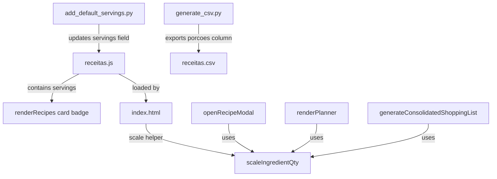

# Porções Reais da Receita (`recipe.servings`) Implementation Plan

> **For agentic workers:** REQUIRED SUB-SKILL: Use superpowers:subagent-driven-development to implement this plan task-by-task. Steps use checkbox (`- [ ]`) syntax for tracking.

**Goal:** Add the `recipe.servings` field and replace the generic portion multiplier with a dynamic servings stepper, scaling ingredients proportionally by person when `servings` is present, while preserving the multiplier fallback when it is null.

**Architecture:** We will implement a Python script to backfill existing recipes with a default servings value of 4 (except condiments), update the CSV exporter to output servings, define CSS styles for the servings badge, implement a unified JS scale helper, and update the Modal, Card Grid, and Weekly Planner UI to dynamically toggle and compute quantities according to the recipe's servings settings.

**Architecture Diagram:**



**Tech Stack:** Vanilla JavaScript (ES6+), HTML5, Vanilla CSS, Python 3, Node.js (for offline JS testing)

## Global Constraints
- Deciding between servings and multiplier mode must rely exclusively on `recipe.servings === null` (or undefined) — never use the recipe category in runtime logic.
- Do not use third-party libraries/npm packages for search, styling, or rendering.
- Keep quantities formatted to a maximum of 2 decimal places using `Number(scaledQty.toFixed(2)).toString()`.

---

### Task 1: Data Schema Backfill and Export Updates (Python Scripts)

**Files:**
- Create: [add_default_servings.py](file:///C:/Sistemas/Projetos/receitas/scripts/add_default_servings.py)
- Create: [test_backfill.py](file:///C:/Sistemas/Projetos/receitas/scratch/test_backfill.py)
- Modify: [generate_csv.py](file:///C:/Sistemas/Projetos/receitas/scripts/generate_csv.py)

**Interfaces:**
- Consumes: [receitas.js](file:///C:/Sistemas/Projetos/receitas/receitas.js) (data)
- Produces:
  - `backfill(data)` -> updated recipes dictionary with servings backfilled
  - `generate_csv.py` generating a CSV containing the `porcoes` column

- [ ] **Step 1: Write the failing test**

Create the file `scratch/test_backfill.py` with the following content to validate backfill logic:
```python
import unittest
import sys
import os

# Append project root to import from scripts directory
sys.path.append(os.path.abspath(os.path.join(os.path.dirname(__file__), '..')))

from scripts.add_default_servings import backfill

class TestBackfill(unittest.TestCase):
    def test_backfill_normal_recipe(self):
        data = {
            "recipes": [
                {"id": 1, "title": "Bolo", "category": "lanches"}
            ]
        }
        res = backfill(data)
        self.assertEqual(res["recipes"][0]["servings"], 4)

    def test_backfill_tempero_recipe(self):
        data = {
            "recipes": [
                {"id": 2, "title": "Sal", "category": "temperos"}
            ]
        }
        res = backfill(data)
        self.assertIsNone(res["recipes"][0]["servings"])

    def test_backfill_tempero_multitag_recipe(self):
        data = {
            "recipes": [
                {"id": 3, "title": "Molho Especial", "category": ["almoco", "temperos"]}
            ]
        }
        res = backfill(data)
        self.assertIsNone(res["recipes"][0]["servings"])

    def test_backfill_does_not_overwrite_existing(self):
        data = {
            "recipes": [
                {"id": 4, "title": "Marmita", "category": "marmitas", "servings": 2}
            ]
        }
        res = backfill(data)
        self.assertEqual(res["recipes"][0]["servings"], 2)

if __name__ == '__main__':
    unittest.main()
```

- [ ] **Step 2: Run test to verify it fails**

Run: `python scratch/test_backfill.py`
Expected: FAIL with `ModuleNotFoundError: No module named 'scripts.add_default_servings'`

- [ ] **Step 3: Write minimal implementation for backfill**

Create the file `scripts/add_default_servings.py` with the following content:
```python
import os
import json

def backfill(data):
    recipes = data.get("recipes", [])
    for recipe in recipes:
        if "servings" not in recipe or recipe["servings"] is None:
            cats = recipe.get("category", [])
            if isinstance(cats, str):
                cats = [cats]
            
            is_tempero = any("temperos" in cat.lower() for cat in cats)
            if is_tempero:
                recipe["servings"] = None
            else:
                recipe["servings"] = 4
    return data

def main():
    script_dir = os.path.dirname(os.path.abspath(__file__))
    project_root = os.path.abspath(os.path.join(script_dir, '..'))
    js_file_path = os.path.join(project_root, 'receitas.js')
    
    if not os.path.exists(js_file_path):
        print(f"Erro: {js_file_path} não encontrado.")
        return
        
    with open(js_file_path, 'r', encoding='utf-8') as f:
        content = f.read()
        
    decl_token = 'const receitasData ='
    start_idx = content.find(decl_token)
    if start_idx == -1:
        print("Erro: Não foi possível encontrar a declaração 'const receitasData ='.")
        return
        
    start_brace = content.find('{', start_idx)
    end_brace = content.rfind('}')
    
    json_str = content[start_brace : end_brace + 1]
    data = json.loads(json_str)
    
    updated_data = backfill(data)
    
    new_json_str = json.dumps(updated_data, indent=4, ensure_ascii=False)
    new_content = content[:start_brace] + new_json_str + content[end_brace+1:]
    
    with open(js_file_path, 'w', encoding='utf-8') as f:
        f.write(new_content)
        
    print("Backfill finalizado com sucesso!")

if __name__ == '__main__':
    main()
```

- [ ] **Step 4: Run test to verify it passes**

Run: `python scratch/test_backfill.py`
Expected: PASS

- [ ] **Step 5: Run Python Backfill on recipes database**

Run: `python scripts/add_default_servings.py`
Expected: Outputs "Backfill finalizado com sucesso!" and `receitas.js` shows the `"servings"` key added (e.g. 4 or null).

- [ ] **Step 6: Update generate_csv.py export logic**

Modify `scripts/generate_csv.py` to add `porcoes` column to headers and row builder:
```diff
@@ -70,5 +70,6 @@
         writer = csv.writer(f, delimiter=';', quoting=csv.QUOTE_ALL)
         # Escreve o cabeçalho
-        writer.writerow(["id", "titulo", "ingrediente", "categorias"])
+        writer.writerow(["id", "titulo", "ingrediente", "categorias", "porcoes"])
         
         for row in rows:
-            writer.writerow([row["id"], row["titulo"], row["ingrediente"], row["categorias"]])
+            portions = recipe.get("servings")
+            portions_str = str(portions) if portions is not None else ""
+            writer.writerow([row["id"], row["titulo"], row["ingrediente"], row["categorias"], portions_str])
```
*Note: Make sure to extract `recipe` in the CSV loop to access `servings` correctly.*

- [ ] **Step 7: Verify generate_csv.py runs successfully**

Run: `python scripts/generate_csv.py`
Expected: `scripts/receitas.csv` is updated with a `porcoes` column at the end showing `4` or empty fields for condiments.

- [ ] **Step 8: Commit Task 1**

Run:
```bash
git add scripts/add_default_servings.py scripts/generate_csv.py receitas.js
git commit -m "feat(database): backfill recipe servings and update CSV exporter"
```

---

### Task 2: Card Grid Serving Badges and Styles

**Files:**
- Modify: [estilos.css](file:///C:/Sistemas/Projetos/receitas/estilos.css)
- Modify: [index.html](file:///C:/Sistemas/Projetos/receitas/index.html)

**Interfaces:**
- Consumes: `recipe.servings`
- Produces: Visual servings badge in card footer UI

- [ ] **Step 1: Define CSS classes in estilos.css**

Add the `.card-meta` and `.card-servings-count` styles at the bottom of the card block in `estilos.css` (around line 753, next to `.card-ingredients-count`):
```css
.card-meta {
    display: flex;
    flex-direction: column;
    gap: 4px;
}

.card-servings-count {
    font-size: 12px;
    color: var(--text-muted);
    font-weight: 500;
    display: flex;
    align-items: center;
    gap: 4px;
}
```

- [ ] **Step 2: Update renderRecipes card template in index.html**

Modify `renderRecipes()` in `index.html` (around line 677) to wrap `.card-ingredients-count` in `.card-meta` and conditionally append `.card-servings-count`:
```diff
-                            <div class="card-footer">
-                                <span class="card-ingredients-count">
-                                    <svg xmlns="http://www.w3.org/2000/svg" fill="none" viewBox="0 0 24 24" stroke="currentColor" stroke-width="2" aria-hidden="true">
-                                        <path stroke-linecap="round" stroke-linejoin="round" d="M19 11H5m14 0a2 2 0 012 2v6a2 2 0 01-2 2H5a2 2 0 01-2-2v-6a2 2 0 012-2m14 0V9a2 2 0 00-2-2M5 11V9a2 2 0 012-2m0 0V5a2 2 0 012-2h6a2 2 0 012 2v2M7 7h10" />
-                                    </svg>
-                                    ${recipe.ingredients.length} ing.
-                                </span>
+                            <div class="card-footer">
+                                <div class="card-meta">
+                                    <span class="card-ingredients-count">
+                                        <svg xmlns="http://www.w3.org/2000/svg" fill="none" viewBox="0 0 24 24" stroke="currentColor" stroke-width="2" aria-hidden="true">
+                                            <path stroke-linecap="round" stroke-linejoin="round" d="M19 11H5m14 0a2 2 0 012 2v6a2 2 0 01-2 2H5a2 2 0 01-2-2v-6a2 2 0 012-2m14 0V9a2 2 0 00-2-2M5 11V9a2 2 0 012-2m0 0V5a2 2 0 012-2h6a2 2 0 012 2v2M7 7h10" />
+                                        </svg>
+                                        ${recipe.ingredients.length} ing.
+                                    </span>
+                                    ${recipe.servings !== undefined && recipe.servings !== null ? `
+                                    <span class="card-servings-count" title="Rendimento da receita">
+                                        👥 ${recipe.servings} pessoas
+                                    </span>
+                                    ` : ''}
+                                </div>
```

- [ ] **Step 3: Commit Task 2**

Run:
```bash
git add estilos.css index.html
git commit -m "style(ui): add servings badge to recipe cards"
```

---

### Task 3: Scale Helper and Recipe Modal Logic

**Files:**
- Modify: [index.html](file:///C:/Sistemas/Projetos/receitas/index.html)
- Create: [test_servings.js](file:///C:/Sistemas/Projetos/receitas/scratch/test_servings.js)

**Interfaces:**
- Consumes: `qty`, `activePortions`, `servings`
- Produces:
  - `scaleIngredientQty(qty, activePortions, servings)` -> number | null
  - Updated portion stepper and ingredients list in modal

- [ ] **Step 1: Write the failing unit test**

Create the file `scratch/test_servings.js` with the following content:
```javascript
const fs = require('fs');
const path = require('path');

const htmlPath = path.resolve(__dirname, '../index.html');
let content;
try {
    content = fs.readFileSync(htmlPath, 'utf8');
} catch (e) {
    console.error("Could not read index.html");
    process.exit(1);
}

function extractFunction(funcName) {
    const startIdx = content.indexOf(`function ${funcName}`);
    if (startIdx === -1) {
        throw new Error(`Function ${funcName} not found in index.html`);
    }
    const openBraceIdx = content.indexOf('{', startIdx);
    if (openBraceIdx === -1) {
        throw new Error(`Open brace not found for function ${funcName}`);
    }
    let braceCount = 1;
    let i = openBraceIdx + 1;
    while (braceCount > 0 && i < content.length) {
        if (content[i] === '{') {
            braceCount++;
        } else if (content[i] === '}') {
            braceCount--;
        }
        i++;
    }
    return content.substring(openBraceIdx + 1, i - 1);
}

try {
    const scaleBody = extractFunction('scaleIngredientQty');
    const scaleIngredientQty = new Function('qty', 'activePortions', 'servings', scaleBody);

    console.log("Running servings logic tests...");
    
    // Test 1: Recipe without portions (servings null), multiplier 1x
    let res1 = scaleIngredientQty(100, 1, null);
    if (res1 !== 100) throw new Error(`Test 1 Failed: expected 100, got ${res1}`);

    // Test 2: Recipe without portions (servings null), multiplier 3x
    let res2 = scaleIngredientQty(150, 3, null);
    if (res2 !== 450) throw new Error(`Test 2 Failed: expected 450, got ${res2}`);

    // Test 3: Recipe with portions (servings = 4), scaled to 8 people
    let res3 = scaleIngredientQty(200, 8, 4);
    if (res3 !== 400) throw new Error(`Test 3 Failed: expected 400, got ${res3}`);

    // Test 4: Recipe with portions (servings = 4), scaled to 2 people
    let res4 = scaleIngredientQty(200, 2, 4);
    if (res4 !== 100) throw new Error(`Test 4 Failed: expected 100, got ${res4}`);

    // Test 5: Qty null (a gosto / opcional)
    let res5 = scaleIngredientQty(null, 5, 4);
    if (res5 !== null) throw new Error(`Test 5 Failed: expected null, got ${res5}`);

    console.log("All servings logic tests passed!");
} catch (err) {
    console.error("Test execution failed:", err.message);
    process.exit(1);
}
```

- [ ] **Step 2: Run test to verify it fails**

Run: `node scratch/test_servings.js`
Expected: FAIL with `Function scaleIngredientQty not found in index.html`

- [ ] **Step 3: Implement scaleIngredientQty helper in index.html**

Add the helper function directly below `escapeHtml` in `index.html` (around line 324):
```javascript
        function scaleIngredientQty(qty, activePortions, servings) {
            if (qty === null) return null;
            if (servings !== undefined && servings !== null) {
                return qty * (activePortions / servings);
            }
            return qty * activePortions;
        }
```

- [ ] **Step 4: Run test to verify it passes**

Run: `node scratch/test_servings.js`
Expected: PASS

- [ ] **Step 5: Modify openRecipeModal(id) serving logic**

Modify `openRecipeModal(id)` in `index.html` (around line 1172):
```diff
        function openRecipeModal(id) {
            activeRecipeId = id;
-           activeRecipePortions = 1;
            const recipe = recipes.find(r => r.id === id);
            if (!recipe) return;
+
+           const isServingsMode = recipe.servings !== undefined && recipe.servings !== null;
+           if (isServingsMode) {
+               activeRecipePortions = recipe.servings;
+               document.getElementById('portions-multiplier').innerText = `${activeRecipePortions} pessoas`;
+           } else {
+               activeRecipePortions = 1;
+               document.getElementById('portions-multiplier').innerText = `${activeRecipePortions}x`;
+           }
...
-           document.getElementById('portions-multiplier').innerText = `${activeRecipePortions}x`;
```

- [ ] **Step 6: Refactor changePortions(dir) with boundary limits**

Modify `changePortions(dir)` in `index.html` (around line 1276):
```diff
         // Adjust serving size multiplier
         function changePortions(dir) {
+            const recipe = recipes.find(r => r.id === activeRecipeId);
+            if (!recipe) return;
+
             let next = activeRecipePortions + dir;
-            if (next >= 1 && next <= 10) {
+            const isServingsMode = recipe.servings !== undefined && recipe.servings !== null;
+            const maxLimit = isServingsMode ? 20 : 10;
+
+            if (next >= 1 && next <= maxLimit) {
                 activeRecipePortions = next;
-                document.getElementById('portions-multiplier').innerText = `${activeRecipePortions}x`;
+                if (isServingsMode) {
+                    document.getElementById('portions-multiplier').innerText = `${activeRecipePortions} pessoas`;
+                } else {
+                    document.getElementById('portions-multiplier').innerText = `${activeRecipePortions}x`;
+                }
                 updateIngredientsList();
             }
         }
```

- [ ] **Step 7: Refactor updateIngredientsList() to use scaleIngredientQty**

Modify `updateIngredientsList()` in `index.html` (around line 1286):
```diff
             recipe.ingredients.forEach(ing => {
                 const li = document.createElement('li');
                 li.className = "modal-ingredients-li";
                 
                 let qtyDisplay = '';
                 if (ing.qty !== null) {
-                    const scaledQty = ing.qty * activeRecipePortions;
+                    const scaledQty = scaleIngredientQty(ing.qty, activeRecipePortions, recipe.servings);
                     const formattedQty = Number(scaledQty.toFixed(2)).toString();
                     qtyDisplay = `<strong class="ing-qty-tag">${formattedQty} ${ing.unit}</strong>`;
                 } else if (ing.unit) {
```

- [ ] **Step 8: Refactor addCurrentRecipeToShoppingList() to use scaleIngredientQty**

Modify `addCurrentRecipeToShoppingList()` in `index.html` (around line 1004):
```diff
             recipe.ingredients.forEach(ing => {
                 // Check if already in list to avoid duplicates
                 const exists = shoppingList[recipe.title].some(item => item.name === ing.name);
                 if (!exists) {
-                    let qtyVal = ing.qty !== null ? ing.qty * activeRecipePortions : null;
+                    let qtyVal = scaleIngredientQty(ing.qty, activeRecipePortions, recipe.servings);
                     shoppingList[recipe.title].push({
```

- [ ] **Step 9: Commit Task 3**

Run:
```bash
git add index.html
git commit -m "feat(ui): implement modal servings stepper and ingredients scaler"
```

---

### Task 4: Weekly Planner Migration and Scaling Logic

**Files:**
- Modify: [index.html](file:///C:/Sistemas/Projetos/receitas/index.html)

**Interfaces:**
- Consumes: `localStorage` planned recipes data (portions/people)
- Produces: Updated weekly planner state with `people` and proportional list consolidation

- [ ] **Step 1: Add automated data migration for plannedRecipes**

Modify `plannedRecipes` initialization in `index.html` (around line 305):
```diff
-        let plannedRecipes = JSON.parse(localStorage.getItem('chef_digital_planned')) || [];
+        let plannedRecipes = JSON.parse(localStorage.getItem('chef_digital_planned')) || [];
+        let hasMigrated = false;
+        plannedRecipes = plannedRecipes.map(p => {
+            if (p.portions !== undefined && p.people === undefined) {
+                p.people = p.portions;
+                delete p.portions;
+                hasMigrated = true;
+            }
+            return p;
+        });
+        if (hasMigrated) {
+            localStorage.setItem('chef_digital_planned', JSON.stringify(plannedRecipes));
+        }
```

- [ ] **Step 2: Update togglePlanRecipe(id) default allocation**

Modify `togglePlanRecipe(id)` in `index.html` (around line 841):
```diff
         function togglePlanRecipe(id) {
             const index = plannedRecipes.findIndex(p => p.id === id);
             if (index !== -1) {
                 plannedRecipes.splice(index, 1);
             } else {
-                plannedRecipes.push({ id: id, portions: 1 });
+                const recipe = recipes.find(r => r.id === id);
+                const defaultPeople = (recipe && recipe.servings !== undefined && recipe.servings !== null) ? recipe.servings : 1;
+                plannedRecipes.push({ id: id, people: defaultPeople });
             }
             savePlanner();
```

- [ ] **Step 3: Update changePlannerRecipePortions(id, dir) to modify people**

Modify `changePlannerRecipePortions(id, dir)` in `index.html` (around line 859):
```diff
         function changePlannerRecipePortions(id, dir) {
             const plan = plannedRecipes.find(p => p.id === id);
             if (plan) {
-                let next = plan.portions + dir;
-                if (next >= 1 && next <= 10) {
-                    plan.portions = next;
+                const recipe = recipes.find(r => r.id === id);
+                const isServingsMode = recipe && recipe.servings !== undefined && recipe.servings !== null;
+                const maxLimit = isServingsMode ? 20 : 10;
+                
+                let next = plan.people + dir;
+                if (next >= 1 && next <= maxLimit) {
+                    plan.people = next;
                     savePlanner();
                     renderPlanner();
                 }
             }
         }
```

- [ ] **Step 4: Update renderPlanner() rendering and label**

Modify `renderPlanner()` in `index.html` (around line 907):
```diff
             plannedRecipes.forEach(p => {
                 const recipe = recipes.find(r => r.id === p.id);
                 if (!recipe) return;
 
                 const card = document.createElement('div');
                 card.className = 'drawer-card';
+                
+                const isServingsMode = recipe.servings !== undefined && recipe.servings !== null;
+                const displayValue = isServingsMode ? `${p.people} pessoas` : `${p.people}x`;
+                const labelText = isServingsMode ? "Pessoas:" : "Porções:";
 
                 card.innerHTML = `
                     <div class="drawer-card-top">
@@ -923,9 +927,9 @@
                         </button>
                     </div>
                     <div class="drawer-card-bottom">
-                        <span>Porções:</span>
+                        <span>${labelText}</span>
                         <div class="portion-controls">
                             <button onclick="changePlannerRecipePortions(${recipe.id}, -1)" class="portion-btn" aria-label="Diminuir porções">-</button>
-                            <span class="portion-value">${p.portions}x</span>
+                            <span class="portion-value">${displayValue}</span>
                             <button onclick="changePlannerRecipePortions(${recipe.id}, 1)" class="portion-btn" aria-label="Aumentar porções">+</button>
                         </div>
                     </div>
```

- [ ] **Step 5: Refactor generateConsolidatedShoppingList() scaling math**

Modify `generateConsolidatedShoppingList()` in `index.html` (around line 960):
```diff
             plannedRecipes.forEach(p => {
                 const recipe = recipes.find(r => r.id === p.id);
                 if (!recipe) return;
 
                 recipe.ingredients.forEach(ing => {
                     const normName = ing.name.trim();
                     const normUnit = (ing.unit || "").toLowerCase().trim();
                     const key = `${normName.toLowerCase()}|${normUnit}`;
 
-                    let scaledQty = ing.qty !== null ? ing.qty * p.portions : null;
+                    let scaledQty = scaleIngredientQty(ing.qty, p.people, recipe.servings);
 
                     if (tempConsolidated[key]) {
```

- [ ] **Step 6: Commit Task 4**

Run:
```bash
git add index.html
git commit -m "feat(planner): scale ingredients in weekly planner based on serving logic"
```

---

### Task 5: End-to-End Manual Testing and Verification (Validation)

**Files:**
- None (Local Browser & Python testing)

**Interfaces:**
- Consumes: The fully integrated Chef Digital application
- Produces: Operational visual proof of all requirements passing

- [ ] **Step 1: Clean up temporary test/scratch files**

Delete the temporary test files created in `scratch/`:
- `scratch/test_backfill.py`
- `scratch/test_servings.js`

- [ ] **Step 2: Run CSV Exporter comparison**

1. Run `python scripts/generate_csv.py`.
2. Inspect the resulting `scripts/receitas.csv`. Verify that the new `porcoes` column is present and correctly reflects `4` or is empty for condiment category recipes.

- [ ] **Step 3: Verification of Recipe Card Badge in Browser**

1. Open `index.html` in your web browser.
2. Verify that main meal cards (like "Frango com Batatas") display a badge reading `👥 4 pessoas` in their footer next to the ingredient count.
3. Verify that condiment recipe cards (like "Tempero Caseiro") do not display any servings badge in their footer.

- [ ] **Step 4: Verification of Modal Servings Stepper**

1. Click on a main meal recipe card to open its modal.
2. Confirm the stepper opens with the value `4 pessoas` pre-selected.
3. Use the `+` button to scale up. Verify that the label increases and the ingredients quantities double when hitting `8 pessoas`. Check that you cannot exceed `20 pessoas`.
4. Scale down. Verify that you cannot decrease the servings count below `1 pessoa`.
5. Close the modal, and open a condiment recipe.
6. Verify the stepper displays `1x` (multiplier mode).
7. Confirm that scaling up goes up to `10x` maximum and scales quantities appropriately.

- [ ] **Step 5: Verification of Modal Adding to Shopping List**

1. Open a main meal recipe, scale servings to `8 pessoas`.
2. Click "Adicionar tudo à lista de compras".
3. Open the Shopping List drawer, and check that quantities added for this recipe reflect double the base quantities.

- [ ] **Step 6: Verification of LocalStorage Data Migration**

1. In the browser developer console (F12 -> Application -> Local Storage), manually set `chef_digital_planned` to:
   `[{"id":1,"portions":3}]`
2. Refresh the page.
3. Check the local storage again. Verify that it was successfully migrated to:
   `[{"id":1,"people":3}]`

- [ ] **Step 7: Verification of Weekly Planner and Consolidated Shopping List**

1. Clear the weekly planner.
2. Add a main meal recipe (`servings: 4`) and a condiment recipe (`servings: null`) to the planner.
3. Open the Planner drawer.
4. Verify the main meal shows the label `4 pessoas` (matching its servings) and the condiment shows `1x`.
5. Increase the main meal servings in the drawer to `6 pessoas` and the condiment to `2x`.
6. Click "Consolidar Lista de Compras".
7. Verify that ingredients from both recipes are consolidated correctly (with the main meal scaled by `6 / 4` and the condiment scaled by `2`).

- [ ] **Step 8: Final Git Status Verification**

Ensure only the desired files (`receitas.js`, `estilos.css`, `index.html`, `scripts/generate_csv.py`, `scripts/add_default_servings.py`) are modified/added.
Run:
```bash
git status
```
Expected: Clean list showing only these changes.
