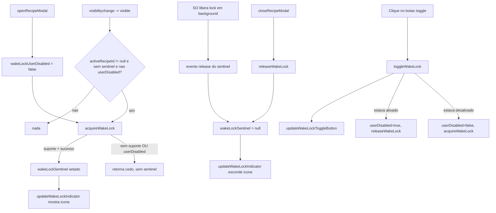

# Tela Ativa Durante o Preparo (Wake Lock) Implementation Plan

> **For agentic workers:** REQUIRED SUB-SKILL: Use superpowers:subagent-driven-development to implement this plan task-by-task. Steps use checkbox (`- [ ]`) syntax for tracking.

**Goal:** Manter a tela do dispositivo ativa automaticamente enquanto o modal de receita estiver aberto, usando a Screen Wake Lock API, com reaquisição automática ao voltar de segundo plano, indicador visual discreto ("🔆") e degradação graciosa em navegadores sem suporte.

**Spec:** [2026-07-27-wake-lock-design.md](file:///C:/Sistemas/Projetos/receitas/docs/superpowers/specs/2026-07-27-wake-lock-design.md)

**Architecture:** Duas variáveis de estado module-level (junto às demais como `activeRecipeId`): `wakeLockSentinel` (guarda o `WakeLockSentinel` atual) e `wakeLockUserDisabled` (intenção do usuário nesta sessão de visualização — **não persiste** em `localStorage`, é resetada para `false` a cada `openRecipeModal()`). `acquireWakeLock()` é chamada no fim de `openRecipeModal()` e também por `toggleWakeLock()` ao reativar; `releaseWakeLock()` é chamada no início de `closeRecipeModal()` e também por `toggleWakeLock()` ao desativar. Um botão dedicado "Manter tela ativa" em `.modal-actions-wrapper` chama `toggleWakeLock()`, que alterna `wakeLockUserDisabled` e aciona `acquireWakeLock()`/`releaseWakeLock()` imediatamente. Um listener único de `visibilitychange`, registrado uma vez no bloco de inicialização, readquire o lock quando a aba volta a ficar visível com o modal ainda aberto **e** o usuário não tiver desativado manualmente (checando `activeRecipeId !== null && !wakeLockUserDisabled`). `updateWakeLockIndicator()` alterna a visibilidade do ícone `#wake-lock-indicator` (🔆, reflete `wakeLockSentinel !== null`, i.e. lock de fato concedido); `updateWakeLockToggleButton()` alterna a aparência/`aria-pressed` do botão de toggle (reflete `!wakeLockUserDisabled`, i.e. intenção do usuário, independente de suporte do navegador).

**Architecture Diagram:**



**Tech Stack:** Vanilla JavaScript (ES6+), HTML5, Vanilla CSS. Sem dependências externas, sem test runner automatizado (validação manual via checklist).

## Global Constraints
- O wake lock é ativado por padrão ao abrir o modal, mas o usuário pode desativá-lo manualmente através de um botão dedicado no modal, mesmo com a receita aberta.
- A preferência de ligado/desligado **não** persiste em `localStorage` — é resetada (`wakeLockUserDisabled = false`) a cada `openRecipeModal()`, então toda nova abertura de receita começa com o comportamento padrão (ativado).
- `acquireWakeLock()` deve checar `'wakeLock' in navigator` e `!wakeLockUserDisabled` antes de chamar `navigator.wakeLock.request`, retornando cedo nos dois casos sem erros de console.
- Todo `await navigator.wakeLock.request('screen')` deve estar em `try/catch` — falhas (`NotAllowedError`, bateria fraca, etc.) devem ser silenciosas, sem `console.error` visível ao usuário nem `throw` não capturado.
- `releaseWakeLock()` apenas libera o `wakeLockSentinel` atual — não deve mexer em `wakeLockUserDisabled` (só `toggleWakeLock()` altera essa flag), para que `closeRecipeModal()` possa reutilizá-la sem afetar a intenção do usuário.
- Reaproveitar `activeRecipeId` (já existe e é `null` quando o modal está fechado) como sinal de "modal aberto" em vez de criar um novo helper de estado redundante.
- O ícone indicador (`#wake-lock-indicator`) só pode ficar visível quando `wakeLockSentinel !== null` (lock de fato concedido), nunca apenas por o modal estar aberto ou pela intenção do usuário.
- Registrar o listener de `visibilitychange` **uma única vez** fora de qualquer função de modal (ex: perto do listener de `keydown`/ESC já existente), nunca dentro de `openRecipeModal()` (evita registrar múltiplos listeners a cada abertura), e ele deve respeitar `wakeLockUserDisabled`.
- O botão de toggle deve seguir o padrão visual já existente dos demais `.btn-modal-action` (planejador, lista de compras, imprimir) em `.modal-actions-wrapper`, incluindo `aria-pressed` para acessibilidade.

---

### Task 1: Estado + funções `acquireWakeLock()` / `releaseWakeLock()` / `toggleWakeLock()` / indicadores

**Files:**
- Modify: [index.html](file:///C:/Sistemas/Projetos/receitas/index.html) (script inline)

**Interfaces:**
- Produces: `wakeLockSentinel`, `wakeLockUserDisabled` (variáveis module-level), `acquireWakeLock()`, `releaseWakeLock()`, `toggleWakeLock()`, `updateWakeLockIndicator()`, `updateWakeLockToggleButton()` — funções globais no mesmo escopo de `openRecipeModal`/`closeRecipeModal`.

- [x] **Step 1: Adicionar as variáveis de estado**

Perto da linha ~392, junto às demais variáveis de estado (`activeRecipePortions`, `activeRecipeId`, `showFavoritesOnly`, `pantryItems`, `pantryFilterActive`), adicionar:

```javascript
let wakeLockSentinel = null;
let wakeLockUserDisabled = false; // intenção do usuário nesta sessão de visualização (não persiste)
```

- [x] **Step 2: Adicionar `acquireWakeLock()`, `releaseWakeLock()`, `toggleWakeLock()` e as funções de indicador**

Próximo a `closeRecipeModal()` (linha ~1424), adicionar:

```javascript
async function acquireWakeLock() {
    if (!('wakeLock' in navigator)) return; // navegador sem suporte, sem indicador
    if (wakeLockUserDisabled) return; // usuário desativou manualmente para esta receita
    try {
        wakeLockSentinel = await navigator.wakeLock.request('screen');
        wakeLockSentinel.addEventListener('release', () => {
            wakeLockSentinel = null;
            updateWakeLockIndicator(); // esconde o ícone
        });
        updateWakeLockIndicator(); // mostra o ícone
    } catch (e) {
        // Falha silenciosa (ex: bateria fraca, NotAllowedError) — app segue normalmente sem o wake lock.
        wakeLockSentinel = null;
    }
}

function releaseWakeLock() {
    if (wakeLockSentinel) {
        wakeLockSentinel.release();
        wakeLockSentinel = null;
    }
    updateWakeLockIndicator();
}

function toggleWakeLock() {
    if (wakeLockUserDisabled) {
        wakeLockUserDisabled = false;
        acquireWakeLock();
    } else {
        wakeLockUserDisabled = true;
        releaseWakeLock();
    }
    updateWakeLockToggleButton();
}

function updateWakeLockIndicator() {
    const indicator = document.getElementById('wake-lock-indicator');
    if (!indicator) return;
    indicator.classList.toggle('visible', wakeLockSentinel !== null);
}

function updateWakeLockToggleButton() {
    const btn = document.getElementById('wake-lock-toggle-btn');
    const text = document.getElementById('wake-lock-toggle-text');
    if (!btn) return;
    const isEnabled = !wakeLockUserDisabled;
    btn.setAttribute('aria-pressed', String(isEnabled));
    btn.classList.toggle('wakelock-active', isEnabled);
    if (text) text.innerText = isEnabled ? 'Manter tela ativa' : 'Tela ativa desligada';
}
```

- [x] **Step 3: Validação manual do Step 1-2**

Abrir `index.html` no navegador, no console rodar `acquireWakeLock()` manualmente e confirmar (via DevTools) que `wakeLockSentinel` deixa de ser `null` em navegadores com suporte (Chrome/Edge); rodar `toggleWakeLock()` duas vezes e confirmar que `wakeLockUserDisabled`/`wakeLockSentinel` alternam corretamente e nenhum erro aparece no console.

---

### Task 2: Integração com o ciclo de vida do modal (`openRecipeModal` / `closeRecipeModal`)

**Files:**
- Modify: [index.html](file:///C:/Sistemas/Projetos/receitas/index.html) (script inline)

**Interfaces:**
- Consumes: `acquireWakeLock()`, `releaseWakeLock()`, `updateWakeLockToggleButton()` (Task 1)

- [x] **Step 1: Resetar a flag e chamar `acquireWakeLock()`/`updateWakeLockToggleButton()` no fim de `openRecipeModal()`**

Ao final de `openRecipeModal()` (linha ~1424), logo após o `setTimeout` que foca o botão de fechar, adicionar (garantindo que toda nova abertura comece com o padrão ativado, sem herdar a desativação de uma receita anterior):

```javascript
            wakeLockUserDisabled = false;
            updateWakeLockToggleButton();
            acquireWakeLock();
        }
```

(mantendo o fechamento de chave da função existente).

- [x] **Step 2: Chamar `releaseWakeLock()` no início de `closeRecipeModal()`**

No início de `closeRecipeModal()` (linha ~1424), antes de remover a classe `open`, adicionar:

```javascript
function closeRecipeModal() {
    releaseWakeLock();
    const modal = document.getElementById('recipe-modal');
    modal.classList.remove('open');
    ...
```

- [x] **Step 3: Validação manual do Step 1-2**

Em um navegador com suporte (Chrome/Edge desktop ou Android), abrir uma receita → confirmar que o lock foi concedido e o botão de toggle aparece no estado "ativado"; fechar o modal → confirmar que foi liberado; reabrir (mesma receita ou outra) → confirmar que volta ativado por padrão mesmo se antes tivesse sido desativado (sem erros de console em nenhum caso).

---

### Task 3: Reaquisição automática via `visibilitychange`

**Files:**
- Modify: [index.html](file:///C:/Sistemas/Projetos/receitas/index.html) (script inline)

**Interfaces:**
- Consumes: `acquireWakeLock()` (Task 1), `activeRecipeId`, `wakeLockSentinel`, `wakeLockUserDisabled`

- [x] **Step 1: Registrar o listener uma única vez**

No bloco de inicialização do script (junto a outros `document.addEventListener`/`window.addEventListener` de nível superior já existentes, ex: o listener de `keydown` para ESC), adicionar:

```javascript
document.addEventListener('visibilitychange', () => {
    if (document.visibilityState === 'visible' && activeRecipeId !== null && !wakeLockSentinel && !wakeLockUserDisabled) {
        acquireWakeLock();
    }
});
```

- [x] **Step 2: Validação manual**

Com o modal de receita aberto (wake lock ativado) em um dispositivo/navegador com suporte, minimizar o app ou bloquear a tela do celular e voltar → confirmar que o wake lock é readquirido automaticamente. Repetir tendo desativado manualmente antes de trocar de aba → confirmar que o lock **não** é readquirido ao voltar.

---

### Task 4: Indicador visual "🔆" e botão de toggle no header do modal

**Files:**
- Modify: [index.html](file:///C:/Sistemas/Projetos/receitas/index.html) (HTML do `#recipe-modal`)
- Modify: [estilos.css](file:///C:/Sistemas/Projetos/receitas/estilos.css) (classes `#wake-lock-indicator` e `.modal-wakelock-btn`)

**Interfaces:**
- Consumes: classe `.visible` alternada por `updateWakeLockIndicator()`; classe `.wakelock-active`/`aria-pressed`/`aria-label`/`title` alternados por `updateWakeLockToggleButton()`; `toggleWakeLock()` (Task 1)

- [x] **Step 1: Adicionar o ícone indicador ao HTML do modal**

Dentro de `.modal-header-banner`, próximo ao título (dentro de `.modal-badges`), adicionar um elemento oculto por padrão:

```html
<span id="wake-lock-indicator" aria-label="Tela ativa durante o preparo" title="Tela ativa durante o preparo">🔆</span>
```

- [x] **Step 2: Adicionar o botão de toggle na `.modal-header-banner`, ao lado do botão de fechar**

Ao lado de `.modal-close-btn` (dentro de `.modal-header-banner`, não em `.modal-actions-wrapper`), como botão circular icon-only no mesmo padrão visual de `.modal-close-btn`:

```html
<button id="wake-lock-toggle-btn" onclick="toggleWakeLock()" class="modal-wakelock-btn wakelock-active" aria-pressed="true" title="Manter tela ativa" aria-label="Manter tela ativa durante o preparo">
    <svg xmlns="http://www.w3.org/2000/svg" fill="none" viewBox="0 0 24 24" stroke="currentColor" stroke-width="2" aria-hidden="true">
        <path stroke-linecap="round" stroke-linejoin="round" d="M12 3v1m0 16v1m9-9h-1M4 12H3m15.364 6.364l-.707-.707M6.343 6.343l-.707-.707m12.728 0l-.707.707M6.343 17.657l-.707.707M16 12a4 4 0 11-8 0 4 4 0 018 0z" />
    </svg>
</button>
```

- [x] **Step 3: Estilos em `estilos.css`**

Adicionar a regra de visibilidade condicional do ícone indicador e o estilo `.modal-wakelock-btn` (posicionado em `position: absolute; top: 16px; right: 68px` — à esquerda do `.modal-close-btn`, que ocupa `right: 16px` com 44px de largura —, reaproveitando o mesmo padrão circular/44px):

```css
#wake-lock-indicator {
    display: none;
    font-size: 1rem;
    margin-left: 0.4rem;
    vertical-align: middle;
}

#wake-lock-indicator.visible {
    display: inline-block;
}

.modal-wakelock-btn {
    position: absolute;
    top: 16px;
    right: 68px;
    z-index: 10;
    background-color: rgba(0, 0, 0, 0.15);
    color: var(--text-white);
    border-radius: var(--radius-full);
    width: 44px;
    height: 44px;
    display: flex;
    align-items: center;
    justify-content: center;
    transition: transform var(--transition-fast), background-color var(--transition-fast), color var(--transition-fast);
}

.modal-wakelock-btn:hover {
    background-color: rgba(0, 0, 0, 0.3);
    transform: scale(1.05);
}

.modal-wakelock-btn:active {
    transform: scale(0.95);
}

.modal-wakelock-btn svg {
    width: 18px;
    height: 18px;
}

.modal-wakelock-btn.wakelock-active {
    background-color: rgba(255, 255, 255, 0.9);
    color: var(--primary-color);
}

.modal-wakelock-btn.wakelock-active:hover {
    background-color: var(--text-white);
}
```

Também adicionar `.modal-wakelock-btn` e `#wake-lock-indicator` à lista de seletores escondidos no bloco `@media print` já existente (junto a `.modal-close-btn`), já que o botão não pertence a `.btn-modal-action`/`.print-btn`.

- [x] **Step 4: Validação manual (checklist completo da spec, seção 5)**

1. Abrir uma receita no Chrome/Edge desktop ou Android → confirmar que o ícone "🔆" aparece, o botão de toggle no header mostra o estado ativado (fundo claro), e a tela não apaga sozinha.
2. Fechar o modal → confirmar que o ícone some e o bloqueio automático da tela volta ao normal.
3. Com o modal aberto, trocar de aba (ou minimizar/bloquear a tela no celular) e voltar → confirmar que o wake lock é readquirido automaticamente (ícone reaparece).
4. Testar em um navegador/dispositivo sem suporte à API (ex: Safari mais antigo) → confirmar que não há erros no console, o app funciona normalmente, sem o ícone (o botão pode continuar visível, sem efeito perceptível).
5. Testar em `file://` diretamente (abrindo `index.html` sem servidor) → confirmar o comportamento (com ou sem suporte da API), sem quebrar nenhuma outra funcionalidade do app.
6. Clicar no botão de toggle no header para desativar → confirmar que o ícone "🔆" some e o botão muda para o estilo "desativado" (fundo escuro, igual ao botão de fechar).
7. Com o wake lock desativado manualmente, trocar de aba e voltar → confirmar que o lock **não** é readquirido automaticamente.
8. Clicar novamente no botão para reativar → confirmar que o ícone volta a aparecer imediatamente.
9. Fechar o modal com o wake lock desativado manualmente e reabrir (a mesma receita ou outra) → confirmar que o wake lock volta a ativar por padrão.
10. Verificar visualmente que o botão de toggle não se sobrepõe ao botão de fechar em telas estreitas (mobile).

---

### Task 5: Atualizar o índice de specs

**Files:**
- Modify: [README.md](file:///C:/Sistemas/Projetos/receitas/docs/superpowers/specs/README.md)

- [x] **Step 1: Marcar a spec de Wake Lock como implementada**

Após concluir e validar as Tasks 1-4, atualizar a linha correspondente da tabela em `README.md` de `⬜ Não implementado` para `✅ Implementado`.
