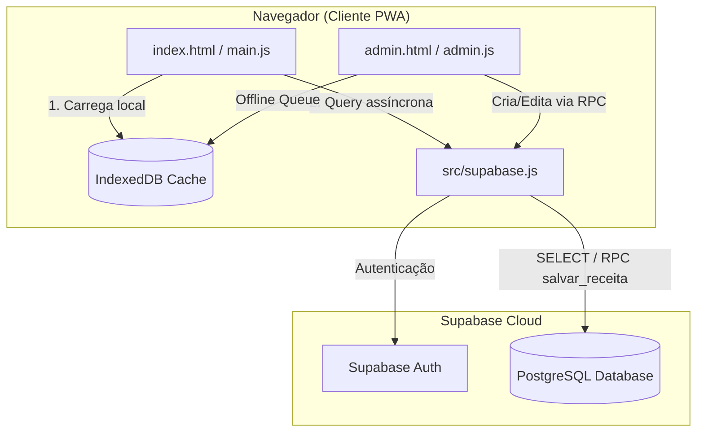

# Plano de Implementação: Migração para Supabase e Vite

> **For agentic workers:** REQUIRED SUB-SKILL: Use superpowers:subagent-driven-development to implement this plan task-by-task. Steps use checkbox (`- [ ]`) syntax for tracking.

**Goal:** Migrar o banco de dados do Chef Digital para o Supabase, estruturar o projeto com o Vite e garantir o funcionamento offline-first via IndexedDB e a tela de admin com deploy no GitHub Pages.

**Architecture:** A aplicação passará de carregamento síncrono local para carregamento assíncrono modularizado via Vite. Na inicialização, lê do cache local (IndexedDB) e depois faz o fetch em segundo plano do Supabase para atualizar o cache local. Gravações administrativas usam uma RPC atômica no banco para evitar inconsistências.

**Architecture Diagram:**


**Tech Stack:** Vite, @supabase/supabase-js, vite-plugin-pwa, IndexedDB (API nativa).

## Global Constraints
* Usar o Vite para build e desenvolvimento local.
* Manter o comportamento offline do PWA via cache-first para assets e IndexedDB para dados.
* Chaves públicas `anon` expostas no client protegidas por RLS.
* Escritas restritas apenas a usuários na tabela `admins`.

---

### Task 1: Scaffolding e Infraestrutura Vite

**Files:**
* Create: `package.json`
* Create: `vite.config.js`
* Create: `.env.example`
* Create: `.env`
* Modify: `.gitignore`

**Interfaces:**
* Produces: Servidor de desenvolvimento local e script de build compatíveis com GitHub Pages.

- [ ] **Passo 1: Criar o package.json**
  Criar o arquivo `package.json` na raiz do projeto com as dependências do Vite, Supabase e o plugin PWA:
  ```json
  {
    "name": "chef-digital",
    "private": true,
    "version": "1.0.0",
    "type": "module",
    "scripts": {
      "dev": "vite",
      "build": "vite build",
      "preview": "vite preview"
    },
    "dependencies": {
      "@supabase/supabase-js": "^2.39.8"
    },
    "devDependencies": {
      "vite": "^5.1.4",
      "vite-plugin-pwa": "^0.19.0"
    }
  }
  ```

- [ ] **Passo 2: Criar o arquivo de configuração vite.config.js**
  Criar `vite.config.js` com a URL base do GitHub Pages e as diretivas do Service Worker automático:
  ```javascript
  import { defineConfig } from 'vite';
  import { VitePWA } from 'vite-plugin-pwa';

  export default defineConfig({
    base: '/receitas/',
    plugins: [
      VitePWA({
        registerType: 'autoUpdate',
        manifest: {
          name: 'Chef Digital',
          short_name: 'ChefDigital',
          description: 'Seu livro de receitas pessoal sem anúncios.',
          theme_color: '#fafaf9',
          background_color: '#fafaf9',
          display: 'standalone',
          orientation: 'portrait',
          start_url: '/receitas/',
          scope: '/receitas/',
          icons: [
            {
              src: '1.png',
              sizes: '192x192',
              type: 'image/png'
            }
          ]
        },
        workbox: {
          globPatterns: ['**/*.{js,css,html,png,svg,ico}']
        }
      })
    ]
  });
  ```

- [ ] **Passo 3: Criar arquivos de configuração .env e .env.example**
  Criar `.env.example`:
  ```env
  VITE_SUPABASE_URL=https://seu-projeto.supabase.co
  VITE_SUPABASE_ANON_KEY=sua-chave-anon-publica
  ```
  Duplicar e salvar como `.env` preenchendo com credenciais temporárias para teste local.

- [ ] **Passo 4: Atualizar .gitignore**
  Garantir que arquivos locais gerados e sensíveis não sejam commitados:
  ```diff
  +node_modules/
  +dist/
  +.env
  +.env.local
  ```

---

### Task 2: Cliente Supabase e Modelagem no Banco

**Files:**
* Create: `src/supabase.js`

**Interfaces:**
* Consumes: Variáveis de ambiente `VITE_SUPABASE_URL` e `VITE_SUPABASE_ANON_KEY`.
* Produces: Instância global compartilhada do cliente do Supabase.

- [ ] **Passo 1: Criar o arquivo src/supabase.js**
  Inicializar o SDK do Supabase de forma centralizada:
  ```javascript
  import { createClient } from '@supabase/supabase-js';

  const supabaseUrl = import.meta.env.VITE_SUPABASE_URL;
  const supabaseAnonKey = import.meta.env.VITE_SUPABASE_ANON_KEY;

  if (!supabaseUrl || !supabaseAnonKey) {
    console.error('Supabase URL ou Anon Key não configuradas no .env');
  }

  export const supabase = createClient(supabaseUrl, supabaseAnonKey);
  ```

- [ ] **Passo 2: Configurar Schema SQL no painel do Supabase**
  > [!IMPORTANT]
  > Execute este bloco SQL no editor SQL do painel do seu Supabase para criar as tabelas, RLS e a função salvar_receita.

  ```sql
  -- Tabelas do sistema
  CREATE TABLE IF NOT EXISTS categorias (
    key TEXT PRIMARY KEY,
    label TEXT NOT NULL,
    sort_order INT NOT NULL DEFAULT 0
  );

  CREATE TABLE IF NOT EXISTS receitas (
    id INT PRIMARY KEY,
    title TEXT NOT NULL,
    emoji TEXT NOT NULL DEFAULT '🍲',
    image TEXT,
    source TEXT,
    tips TEXT,
    category TEXT[] NOT NULL DEFAULT '{}',
    created_at TIMESTAMP WITH TIME ZONE DEFAULT TIMEZONE('utc'::text, NOW()) NOT NULL,
    updated_at TIMESTAMP WITH TIME ZONE DEFAULT TIMEZONE('utc'::text, NOW()) NOT NULL
  );

  CREATE SEQUENCE IF NOT EXISTS receitas_id_seq OWNED BY receitas.id;
  ALTER TABLE receitas ALTER COLUMN id SET DEFAULT nextval('receitas_id_seq');

  CREATE TABLE IF NOT EXISTS ingredientes (
    id UUID DEFAULT gen_random_uuid() PRIMARY KEY,
    receita_id INT REFERENCES receitas(id) ON DELETE CASCADE NOT NULL,
    name TEXT NOT NULL,
    qty NUMERIC,
    unit TEXT,
    ordem INT NOT NULL
  );

  CREATE TABLE IF NOT EXISTS passos (
    id UUID DEFAULT gen_random_uuid() PRIMARY KEY,
    receita_id INT REFERENCES receitas(id) ON DELETE CASCADE NOT NULL,
    step_text TEXT NOT NULL,
    ordem INT NOT NULL
  );

  CREATE TABLE IF NOT EXISTS admins (
    user_id UUID PRIMARY KEY REFERENCES auth.users(id) ON DELETE CASCADE
  );

  -- Trigger para updated_at
  CREATE OR REPLACE FUNCTION set_updated_at() RETURNS TRIGGER AS $$
  BEGIN
    NEW.updated_at = TIMEZONE('utc'::text, NOW());
    RETURN NEW;
  END;
  $$ LANGUAGE plpgsql;

  CREATE OR REPLACE TRIGGER trg_receitas_updated_at BEFORE UPDATE ON receitas
    FOR EACH ROW EXECUTE FUNCTION set_updated_at();

  -- is_admin helper
  CREATE OR REPLACE FUNCTION is_admin() RETURNS BOOLEAN AS $$
    SELECT EXISTS (SELECT 1 FROM admins WHERE user_id = auth.uid());
  $$ LANGUAGE sql STABLE SECURITY DEFINER;

  -- Habilitar RLS
  ALTER TABLE categorias ENABLE ROW LEVEL SECURITY;
  ALTER TABLE receitas ENABLE ROW LEVEL SECURITY;
  ALTER TABLE ingredientes ENABLE ROW LEVEL SECURITY;
  ALTER TABLE passos ENABLE ROW LEVEL SECURITY;

  -- Políticas públicas
  CREATE POLICY "Permitir leitura pública" ON categorias FOR SELECT USING (true);
  CREATE POLICY "Permitir leitura pública" ON receitas FOR SELECT USING (true);
  CREATE POLICY "Permitir leitura pública" ON ingredientes FOR SELECT USING (true);
  CREATE POLICY "Permitir leitura pública" ON passos FOR SELECT USING (true);

  -- Políticas administrativas
  CREATE POLICY "Somente admin modifica" ON receitas FOR ALL TO authenticated USING (is_admin()) WITH CHECK (is_admin());
  CREATE POLICY "Somente admin modifica" ON ingredientes FOR ALL TO authenticated USING (is_admin()) WITH CHECK (is_admin());
  CREATE POLICY "Somente admin modifica" ON passos FOR ALL TO authenticated USING (is_admin()) WITH CHECK (is_admin());
  CREATE POLICY "Somente admin modifica" ON categorias FOR ALL TO authenticated USING (is_admin()) WITH CHECK (is_admin());

  -- Função de Salvamento Atômico (RPC)
  CREATE OR REPLACE FUNCTION salvar_receita(
    p_id INT,
    p_title TEXT,
    p_emoji TEXT,
    p_image TEXT,
    p_source TEXT,
    p_tips TEXT,
    p_category TEXT[],
    p_ingredientes JSONB,
    p_passos JSONB
  ) RETURNS INT AS $$
  DECLARE
    v_receita_id INT;
    v_ingrediente RECORD;
    v_passo RECORD;
  BEGIN
    IF NOT is_admin() THEN
      RAISE EXCEPTION 'Acesso negado: Somente administradores podem salvar receitas.';
    END IF;

    IF p_id IS NOT NULL AND EXISTS (SELECT 1 FROM receitas WHERE id = p_id) THEN
      UPDATE receitas
      SET title = p_title,
          emoji = p_emoji,
          image = p_image,
          source = p_source,
          tips = p_tips,
          category = p_category
      WHERE id = p_id;
      v_receita_id := p_id;
    ELSE
      INSERT INTO receitas (title, emoji, image, source, tips, category)
      VALUES (p_title, p_emoji, p_image, p_source, p_tips, p_category)
      RETURNING id INTO v_receita_id;
    END IF;

    DELETE FROM ingredientes WHERE receita_id = v_receita_id;
    FOR v_ingrediente IN SELECT * FROM jsonb_to_recordset(p_ingredientes) AS x(name TEXT, qty NUMERIC, unit TEXT, ordem INT) LOOP
      INSERT INTO ingredientes (receita_id, name, qty, unit, ordem)
      VALUES (v_receita_id, v_ingrediente.name, v_ingrediente.qty, v_ingrediente.unit, v_ingrediente.ordem);
    END LOOP;

    DELETE FROM passos WHERE receita_id = v_receita_id;
    FOR v_passo IN SELECT * FROM jsonb_to_recordset(p_passos) AS x(step_text TEXT, ordem INT) LOOP
      INSERT INTO passos (receita_id, step_text, ordem)
      VALUES (v_receita_id, v_passo.step_text, v_passo.ordem);
    END LOOP;

    RETURN v_receita_id;
  END;
  $$ LANGUAGE plpgsql SECURITY DEFINER;
  ```

---

### Task 3: Script de Migração (Node.js)

**Files:**
* Create: `scripts/migrate.js`

**Interfaces:**
* Consumes: Variáveis de ambiente de sistema `SUPABASE_URL` e `SUPABASE_SERVICE_ROLE_KEY` (usada localmente para ignorar RLS durante a migração) e o arquivo `receitas.js`.
* Produces: Exportação de todas as 125 receitas locais para as tabelas do Supabase.

- [ ] **Passo 1: Escrever scripts/migrate.js**
  Criar o script que fará o parse de `receitas.js` e a inserção idempotente:
  ```javascript
  import { createClient } from '@supabase/supabase-js';
  import fs from 'fs';
  import path from 'path';

  const supabaseUrl = process.env.SUPABASE_URL;
  const serviceRoleKey = process.env.SUPABASE_SERVICE_ROLE_KEY;

  if (!supabaseUrl || !serviceRoleKey) {
    console.error('Erro: Defina SUPABASE_URL e SUPABASE_SERVICE_ROLE_KEY no ambiente.');
    process.exit(1);
  }

  const supabase = createClient(supabaseUrl, serviceRoleKey, {
    auth: { persistSession: false }
  });

  async function migrate() {
    console.log('Iniciando migração...');
    
    // Importa dados do receitas.js atual removendo a declaração Javascript para obter JSON puro
    const receitasJsPath = path.resolve('receitas.js');
    let content = fs.readFileSync(receitasJsPath, 'utf8');
    const startIdx = content.indexOf('const receitasData =');
    const startBrace = content.indexOf('{', startIdx);
    const endBrace = content.lastIndexOf('}');
    const jsonStr = content.slice(startBrace, endBrace + 1);
    
    const data = JSON.parse(jsonStr);
    const categories = data.categories;
    const recipes = data.recipes;

    // 1. Migrar Categorias
    let sortOrder = 0;
    for (const [key, label] of Object.entries(categories)) {
      const { error } = await supabase.from('categorias').upsert({
        key, label, sort_order: sortOrder++
      }, { onConflict: 'key' });
      if (error) console.error(`Erro na categoria ${key}:`, error);
    }
    console.log('Categorias migradas com sucesso.');

    // 2. Migrar Receitas
    for (const r of recipes) {
      console.log(`Migrando receita: ${r.title} (ID: ${r.id})...`);
      
      const { error: rError } = await supabase.from('receitas').upsert({
        id: r.id,
        title: r.title,
        emoji: r.emoji,
        image: r.image || null,
        source: r.source || null,
        tips: r.tips || null,
        category: Array.isArray(r.category) ? r.category : [r.category]
      }, { onConflict: 'id' });

      if (rError) {
        console.error(`Erro ao inserir receita ID ${r.id}:`, rError);
        continue;
      }

      // Limpa ingredientes antigos para manter idempotência
      await supabase.from('ingredientes').delete().eq('receita_id', r.id);
      if (r.ingredients && r.ingredients.length > 0) {
        const ingredientsData = r.ingredients.map((ing, idx) => ({
          receita_id: r.id,
          name: ing.name,
          qty: ing.qty,
          unit: ing.unit,
          ordem: idx
        }));
        const { error: ingError } = await supabase.from('ingredientes').insert(ingredientsData);
        if (ingError) console.error(`Erro ingredientes da receita ${r.id}:`, ingError);
      }

      // Limpa passos antigos
      await supabase.from('passos').delete().eq('receita_id', r.id);
      if (r.steps && r.steps.length > 0) {
        const stepsData = r.steps.map((step, idx) => ({
          receita_id: r.id,
          step_text: step,
          ordem: idx
        }));
        const { error: stepError } = await supabase.from('passos').insert(stepsData);
        if (stepError) console.error(`Erro passos da receita ${r.id}:`, stepError);
      }
    }

    // Ajusta a sequence das receitas
    await supabase.rpc('setval', {
      seq: 'receitas_id_seq',
      val: Math.max(...recipes.map(r => r.id))
    });

    console.log('Migração concluída com sucesso!');
  }

  migrate();
  ```

---

### Task 4: Camada de Cache Offline (IndexedDB)

**Files:**
* Create: `src/cache.js`

**Interfaces:**
* Produces: Métodos de manipulação do cache offline: `salvarCacheLocal`, `lerCacheLocal`, `enfileirarSincronizacao`, `processarFilaOnline`.

- [ ] **Passo 1: Escrever src/cache.js**
  Criar a lógica IndexedDB pura para gerenciar o cache local de receitas e a fila de sincronização pendente:
  ```javascript
  const DB_NAME = 'ChefDigitalDB';
  const DB_VERSION = 1;

  function openDB() {
    return new Promise((resolve, reject) => {
      const request = indexedDB.open(DB_NAME, DB_VERSION);

      request.onupgradeneeded = (event) => {
        const db = event.target.result;
        if (!db.objectStoreNames.contains('receitas')) {
          db.createObjectStore('receitas', { keyPath: 'id' });
        }
        if (!db.objectStoreNames.contains('categorias')) {
          db.createObjectStore('categorias', { keyPath: 'key' });
        }
        if (!db.objectStoreNames.contains('sync_queue')) {
          db.createObjectStore('sync_queue', { keyPath: 'id', autoIncrement: true });
        }
      };

      request.onsuccess = (event) => resolve(event.target.result);
      request.onerror = (event) => reject(event.target.error);
    });
  }

  export async function salvarCacheLocal(storeName, data) {
    const db = await openDB();
    return new Promise((resolve, reject) => {
      const tx = db.transaction(storeName, 'readwrite');
      const store = tx.objectStore(storeName);
      store.clear();
      data.forEach(item => store.put(item));
      tx.oncomplete = () => resolve();
      tx.onerror = () => reject(tx.error);
    });
  }

  export async function lerCacheLocal(storeName) {
    const db = await openDB();
    return new Promise((resolve, reject) => {
      const tx = db.transaction(storeName, 'readonly');
      const store = tx.objectStore(storeName);
      const request = store.getAll();
      request.onsuccess = () => resolve(request.result);
      request.onerror = () => reject(request.error);
    });
  }

  export async function enfileirarSincronizacao(payload) {
    const db = await openDB();
    return new Promise((resolve, reject) => {
      const tx = db.transaction('sync_queue', 'readwrite');
      const store = tx.objectStore('sync_queue');
      store.put({
        payload,
        timestamp: Date.now(),
        tentativas: 0,
        ultimo_erro: null
      });
      tx.oncomplete = () => resolve();
      tx.onerror = () => reject(tx.error);
    });
  }
  ```

---

### Task 5: Modularização do Livro de Receitas (HTML/JS)

**Files:**
* Create: `src/main.js`
* Modify: `index.html`

**Interfaces:**
* Consumes: Dados obtidos via IndexedDB (`src/cache.js`) e Supabase (`src/supabase.js`).

- [ ] **Passo 1: Criar src/main.js com a lógica atual unificada**
  Mover toda a lógica de manipulação do DOM e filtros que estava no `index.html` inline para o arquivo `src/main.js`, inserindo as chamadas assíncronas ao Supabase e ao cache:
  ```javascript
  import { supabase } from './supabase.js';
  import { salvarCacheLocal, lerCacheLocal } from './cache.js';

  let categories = {};
  let recipes = [];

  async function inicializarApp() {
    // 1. Carrega dados do IndexedDB local (offline-first)
    try {
      const cachedCategories = await lerCacheLocal('categorias');
      const cachedRecipes = await lerCacheLocal('receitas');

      if (cachedCategories.length > 0 && cachedRecipes.length > 0) {
        categories = cachedCategories.reduce((acc, cat) => ({ ...acc, [cat.key]: cat.label }), {});
        recipes = cachedRecipes;
        renderizarApp();
      }
    } catch (e) {
      console.warn('Erro ao carregar cache local:', e);
    }

    // 2. Busca atualizações do Supabase em background
    try {
      const { data: catData, error: catError } = await supabase.from('categorias').select('*').order('sort_order');
      const { data: recData, error: recError } = await supabase
        .from('receitas')
        .select('*, ingredientes(*), passos(*)')
        .order('id');

      if (!catError && !recError) {
        // Atualiza variáveis em memória
        categories = catData.reduce((acc, cat) => ({ ...acc, [cat.key]: cat.label }), {});
        recipes = recData.map(r => ({
          id: r.id,
          title: r.title,
          category: r.category,
          source: r.source,
          emoji: r.emoji,
          image: r.image,
          tips: r.tips,
          ingredients: r.ingredientes.sort((a, b) => a.ordem - b.ordem),
          steps: r.passos.sort((a, b) => a.ordem - b.ordem).map(p => p.step_text)
        }));

        // Atualiza cache local IndexedDB
        await salvarCacheLocal('categorias', catData);
        await salvarCacheLocal('receitas', recipes);

        renderizarApp();
      }
    } catch (err) {
      console.error('Erro na consulta em background do Supabase:', err);
    }
  }

  function renderizarApp() {
    // Aqui vai a lógica original de renderização do DOM do Chef Digital
    // (renderCategoryFilters, renderRecipes, etc.) baseada nos objetos categories e recipes
    console.log('App renderizado com receitas:', recipes.length);
  }

  window.onload = inicializarApp;
  ```

- [ ] **Passo 2: Atualizar o index.html**
  Substituir a inclusão estática do `receitas.js` e a tag script inline por uma tag script do tipo module:
  ```diff
  -    <script src="receitas.js"></script>
  -    <script>
  -        // Scripts inline antigos
  -    </script>
  +    <script type="module" src="/src/main.js"></script>
  ```

---

### Task 6: Painel do Administrador (HTML/JS)

**Files:**
* Create: `admin.html`
* Create: `src/admin.js`

**Interfaces:**
* Consumes: Supabase Auth (`supabase.auth`) e RPC `salvar_receita` do Supabase.

- [ ] **Passo 1: Criar admin.html**
  Criar a página contendo o formulário de autenticação e gerenciamento:
  ```html
  <!DOCTYPE html>
  <html lang="pt-BR">
  <head>
      <meta charset="UTF-8">
      <meta name="viewport" content="width=device-width, initial-scale=1.0">
      <title>Painel Admin - Chef Digital</title>
      <link rel="stylesheet" href="estilos.css">
  </head>
  <body class="bg-neutral-bg">
      <div id="login-container" class="max-w-md mx-auto mt-20 p-6 bg-white rounded-lg shadow">
          <h2 class="text-2xl font-bold mb-4">Acesso Administrativo</h2>
          <input type="email" id="email" placeholder="E-mail" class="w-full p-2 mb-3 border rounded">
          <input type="password" id="password" placeholder="Senha" class="w-full p-2 mb-4 border rounded">
          <button id="btn-login" class="w-full p-3 bg-amber-500 text-white rounded">Entrar</button>
      </div>

      <div id="admin-panel" class="hidden max-w-2xl mx-auto p-6 bg-white rounded-lg shadow mt-10">
          <h2 class="text-2xl font-bold mb-4">Nova Receita</h2>
          <input type="text" id="recipe-title" placeholder="Título da Receita" class="w-full p-2 mb-3 border rounded">
          
          <h3>Ingredientes</h3>
          <div id="ingredients-list" class="mb-4"></div>
          <button id="btn-add-ingredient" class="p-2 bg-neutral-light border rounded mb-4">+ Ingrediente</button>

          <h3>Passos</h3>
          <div id="steps-list" class="mb-4"></div>
          <button id="btn-add-step" class="p-2 bg-neutral-light border rounded mb-4">+ Passo</button>

          <button id="btn-save" class="w-full p-3 bg-green-600 text-white rounded">Salvar Receita</button>
      </div>

      <script type="module" src="/src/admin.js"></script>
  </body>
  </html>
  ```

- [ ] **Passo 2: Criar src/admin.js**
  Implementar controle de autenticação e inputs dinâmicos de ingredientes/passos:
  ```javascript
  import { supabase } from './supabase.js';

  const loginContainer = document.getElementById('login-container');
  const adminPanel = document.getElementById('admin-panel');

  // Verifica Sessão
  supabase.auth.onAuthStateChange((event, session) => {
    if (session) {
      loginContainer.classList.add('hidden');
      adminPanel.classList.remove('hidden');
    } else {
      loginContainer.classList.remove('hidden');
      adminPanel.classList.add('hidden');
    }
  });

  // Login
  document.getElementById('btn-login').onclick = async () => {
    const email = document.getElementById('email').value;
    const password = document.getElementById('password').value;
    const { error } = await supabase.auth.signInWithPassword({ email, password });
    if (error) alert('Erro no login: ' + error.message);
  };

  // Dinâmica de Ingredientes
  document.getElementById('btn-add-ingredient').onclick = () => {
    const container = document.getElementById('ingredients-list');
    const div = document.createElement('div');
    div.className = 'flex gap-2 mb-2';
    div.innerHTML = `
      <input type="number" placeholder="Qtd" class="qty w-20 p-2 border rounded">
      <input type="text" placeholder="Unidade" class="unit w-24 p-2 border rounded">
      <input type="text" placeholder="Nome" class="name flex-1 p-2 border rounded">
      <button class="btn-remove p-2 bg-red-100 text-red-600 rounded">X</button>
    `;
    div.querySelector('.btn-remove').onclick = () => div.remove();
    container.appendChild(div);
  };

  // Dinâmica de Passos
  document.getElementById('btn-add-step').onclick = () => {
    const container = document.getElementById('steps-list');
    const div = document.createElement('div');
    div.className = 'flex gap-2 mb-2';
    div.innerHTML = `
      <textarea placeholder="Etapa do preparo" class="step-text flex-1 p-2 border rounded"></textarea>
      <button class="btn-remove p-2 bg-red-100 text-red-600 rounded">X</button>
    `;
    div.querySelector('.btn-remove').onclick = () => div.remove();
    container.appendChild(div);
  };

  // Salvar Receita
  document.getElementById('btn-save').onclick = async () => {
    const title = document.getElementById('recipe-title').value;
    
    const ingredients = Array.from(document.querySelectorAll('#ingredients-list > div')).map((div, idx) => ({
      name: div.querySelector('.name').value,
      qty: parseFloat(div.querySelector('.qty').value) || null,
      unit: div.querySelector('.unit').value || null,
      ordem: idx
    }));

    const steps = Array.from(document.querySelectorAll('#steps-list > div')).map((div, idx) => ({
      step_text: div.querySelector('.step-text').value,
      ordem: idx
    }));

    const { data, error } = await supabase.rpc('salvar_receita', {
      p_id: null, // Nova receita
      p_title: title,
      p_emoji: '🍲',
      p_image: null,
      p_source: null,
      p_tips: null,
      p_category: ['almoco'], // Padrão inicial
      p_ingredientes: ingredients,
      p_passos: steps
    });

    if (error) {
      alert('Erro ao salvar receita: ' + error.message);
    } else {
      alert('Receita salva com sucesso! ID: ' + data);
      window.location.reload();
    }
  };
  ```

---

### Task 7: Setup da Action de Deploy (GitHub Actions)

**Files:**
* Create: `.github/workflows/deploy.yml`

**Interfaces:**
* Consumes: Secrets `VITE_SUPABASE_URL` e `VITE_SUPABASE_ANON_KEY` configurados nas configurações do repositório no GitHub.

- [ ] **Passo 1: Criar o workflow .github/workflows/deploy.yml**
  Criar a Action de automação que escuta na branch `main`:
  ```yaml
  name: Deploy Chef Digital

  on:
    push:
      branches:
        - main

  permissions:
    contents: read
    pages: write
    id-token: write

  concurrency:
    group: 'pages'
    cancel-in-progress: true

  jobs:
    deploy:
      environment:
        name: github-pages
        url: ${{ steps.deployment.outputs.page_url }}
      runs-on: ubuntu-latest
      steps:
        - name: Checkout
          uses: actions/checkout@v4

        - name: Setup Node
          uses: actions/setup-node@v4
          with:
            node-version: 20
            cache: 'npm'

        - name: Install dependencies
          run: npm ci

        - name: Build
          env:
            VITE_SUPABASE_URL: ${{ secrets.VITE_SUPABASE_URL }}
            VITE_SUPABASE_ANON_KEY: ${{ secrets.VITE_SUPABASE_ANON_KEY }}
          run: npm run build

        - name: Setup Pages
          uses: actions/configure-pages@v4

        - name: Upload Artifact
          uses: actions/upload-pages-artifact@v3
          with:
            path: './dist'

        - name: Deploy to GitHub Pages
          id: deployment
          uses: actions/deploy-pages@v4
  ```
