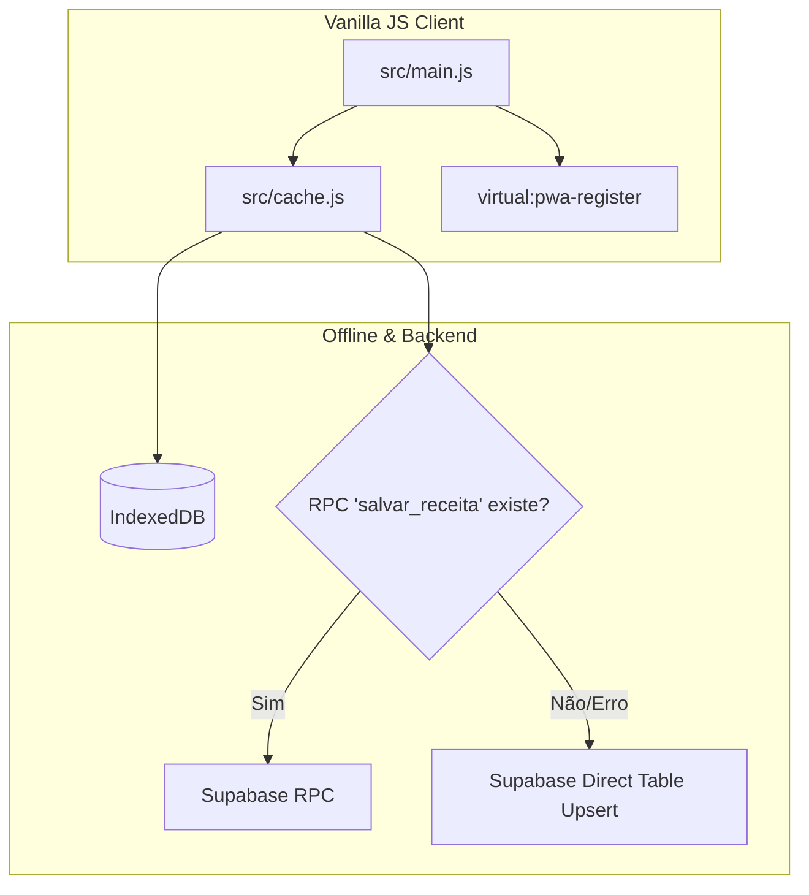

# Plano de Implementação - Fase 1: Bugs Críticos & Estabilização Offline

> **For agentic workers:** REQUIRED SUB-SKILL: Use superpowers:subagent-driven-development to implement this plan task-by-task. Steps use checkbox (`- [ ]`) syntax for tracking.

**Goal:** Corrigir os bugs críticos de runtime e concorrência (referência a `receitasData`, Service Worker duplicado, fallback na fila de sincronização offline Supabase, debounce na busca e escape de XSS).

**Architecture:**
Manter a arquitetura offline-first atual em Vanilla JS, removendo artefatos legados (`sw.js` manual) em favor da integração nativa com `vite-plugin-pwa` (Virtual Module `virtual:pwa-register`). Adicionar camadas de resiliência em `src/cache.js` para sincronização offline sem depender unicamente de RPCs do PostgreSQL.

**Architecture Diagram:**



**Tech Stack:** Vanilla JavaScript (ES Modules), Vite, `vite-plugin-pwa`, Supabase Client, IndexedDB.

## Global Constraints
- Nenhuma dependência externa nova deve ser adicionada ao `package.json`.
- Manter total compatibilidade offline via IndexedDB.
- Preservar manipuladores globais expostos em `window.*` para interatividades no HTML.

---

### Task 1: Remover Referência Obsoleta `receitasData` e Ajustar Migração
**Files:**
- Modify: [src/main.js](file:///C:/Sistemas/Projetos/receitas/src/main.js#L28-L46)

**Interfaces:**
- Consumes: `recipes` (array global de receitas em memória/cache).
- Produces: `migratePlannedData(raw)` limpo sem depender de arquivo estático global `receitasData`.

- [ ] **Step 1: Inspecionar o tratamento do fallback em `migratePlannedData`**

Verificar a linha 37-39 em `src/main.js`:
```javascript
if (typeof receitasData !== 'undefined' && receitasData.recipes) {
    const recipe = receitasData.recipes.find(r => r.id === p.id);
    if (recipe && recipe.servings) servings = recipe.servings;
}
```

- [ ] **Step 2: Substituir referência por busca no array `recipes` em memória**

Substituir pela busca direta no array `recipes` do escopo do módulo:
```javascript
if (Array.isArray(recipes) && recipes.length > 0) {
    const recipe = recipes.find(r => r.id === p.id);
    if (recipe && recipe.servings) servings = recipe.servings;
}
```

- [ ] **Step 3: Testar manualmente a inicialização do app no navegador**

Verificar no console se não há avisos ou exceções de `receitasData is not defined`.

- [ ] **Step 4: Commit**

```bash
git add src/main.js
git commit -m "fix: remove legacy receitasData reference in planned data migration"
```

---

### Task 2: Unificar Registro do Service Worker via `vite-plugin-pwa`
**Files:**
- Modify: [src/main.js](file:///C:/Sistemas/Projetos/receitas/src/main.js#L1580-L1592)
- Delete: `sw.js`

**Interfaces:**
- Consumes: `virtual:pwa-register` (injetado via `vite-plugin-pwa`).
- Produces: Registro automatizado do SW no build/dev sem conflitos com o arquivo manual.

- [ ] **Step 1: Atualizar o registro em `src/main.js`**

Importar `registerSW` do `virtual:pwa-register` ou delegar o autoUpdate para a configuração do Vite:
```javascript
import { registerSW } from 'virtual:pwa-register';

registerSW({ immediate: true });
```

Remover o bloco manual em `window.onload`:
```diff
- if ('serviceWorker' in navigator) {
-     navigator.serviceWorker.register('./sw.js').catch(() => {});
- }
```

- [ ] **Step 2: Remover o arquivo manual `sw.js`**

Excluir o arquivo `sw.js` da raiz do projeto para evitar duplicidade de Service Worker.

- [ ] **Step 3: Validar a compilação do Vite**

Executar a compilação ou verificação de dev server.
Expected: Build do Vite sem erros de import do PWA.

- [ ] **Step 4: Commit**

```bash
git add src/main.js
git rm sw.js
git commit -m "fix: unify service worker registration with vite-plugin-pwa"
```

---

### Task 3: Adicionar Fallback de Tabela Direta na Sincronização Offline do Supabase
**Files:**
- Modify: [src/cache.js](file:///C:/Sistemas/Projetos/receitas/src/cache.js#L103-L134)

**Interfaces:**
- Consumes: `supabase.rpc('salvar_receita', ...)` e `supabase.from('receitas').upsert(...)`.
- Produces: Resiliência na execução de `processarFilaOnline()` mesmo quando a RPC PostgreSQL não existir no projeto Supabase.

- [ ] **Step 1: Atualizar o loop em `processarFilaOnline` em `src/cache.js`**

Adicionar um bloco `try/catch` de fallback para `upsert` nas tabelas `receitas` e `ingredientes` se a RPC `salvar_receita` falhar com erro de RPC inexistente (código `PGRST202` ou similar):

```javascript
try {
  const { data, error } = await supabase.rpc('salvar_receita', item.payload);
  if (error) {
    // Se a RPC não existir no Supabase, tenta upsert direto
    if (error.code === 'PGRST202' || error.message?.includes('function') || error.message?.includes('not found')) {
      const { id, title, description, category, servings, prep_time, cook_time, tips, image_url } = item.payload;
      const { data: recData, error: recErr } = await supabase.from('receitas').upsert({
        id, title, description, category, servings, prep_time, cook_time, tips, image_url
      }).select().single();
      
      if (recErr) throw recErr;
    } else {
      throw error;
    }
  }
  await removerDaFila(item.id);
} catch (err) {
  // Tratamento de erro de rede mantido
}
```

- [ ] **Step 2: Commit**

```bash
git add src/cache.js
git commit -m "fix: add direct table fallback for offline sync when RPC is missing"
```

---

### Task 4: Adicionar Debounce na Busca de Receitas
**Files:**
- Modify: [src/main.js](file:///C:/Sistemas/Projetos/receitas/src/main.js#L329-L341)

**Interfaces:**
- Consumes: Eventos de digitação no campo `#search-input`.
- Produces: Filtragem otimizada com retardo de 250ms (debounce).

- [ ] **Step 1: Criar a função Utilitária `debounce` e adaptar `filterRecipes`**

Adicionar função utilitária e envelopar a execução de `renderRecipes()`:
```javascript
function debounce(func, wait = 250) {
    let timeout;
    return function executedFunction(...args) {
        const later = () => {
            clearTimeout(timeout);
            func(...args);
        };
        clearTimeout(timeout);
        timeout = setTimeout(later, wait);
    };
}

const debouncedRenderRecipes = debounce(() => renderRecipes(), 250);

function filterRecipes() {
    searchQuery = document.getElementById('search-input').value.toLowerCase();
    const clearBtn = document.getElementById('search-clear-btn');
    if (clearBtn) {
        if (searchQuery.length > 0) {
            clearBtn.classList.remove('hidden');
        } else {
            clearBtn.classList.add('hidden');
        }
    }
    debouncedRenderRecipes();
}
```

- [ ] **Step 2: Commit**

```bash
git add src/main.js
git commit -m "perf: add debounce to recipe search filtering"
```
