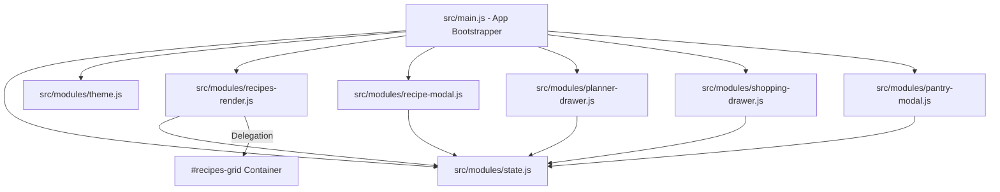

# Plano de Implementação - Fase 2: Refatoração de Arquitetura & Performance

> **For agentic workers:** REQUIRED SUB-SKILL: Use superpowers:subagent-driven-development to implement this plan task-by-task. Steps use checkbox (`- [ ]`) syntax for tracking.

**Goal:** Modularizar o arquivo monólito `src/main.js` em módulos ES limpos organizados por domínio em `src/modules/` e implementar Event Delegation no container `#recipes-grid`.

**Architecture:**
Criar uma estrutura desacoplada baseada em estado centralizado (`src/modules/state.js`) onde os módulos de visualização (`recipes-render.js`, `recipe-modal.js`, `planner-drawer.js`, `shopping-drawer.js`, `pantry-modal.js`) consomem e alteram o estado sem acoplamento direto com o ponto de entrada `src/main.js`.

**Architecture Diagram:**



**Tech Stack:** Vanilla JavaScript (ES Modules), Vite.

## Global Constraints
- Manter 100% de compatibilidade com os seletores DOM e manipuladores `window.*` existentes no `index.html`.
- Nenhuma dependência externa adicional no `package.json`.

---

### Task 1: Criar Módulos de Estado (`state.js`) e Tema (`theme.js`)
**Files:**
- Create: `src/modules/state.js`
- Create: `src/modules/theme.js`
- Modify: `src/main.js`

**Interfaces:**
- Consumes: `localStorage` para carregar favoritos e despensa.
- Produces: Mapeamento reativo e getters/setters limpos para o estado da aplicação.

- [ ] **Step 1: Criar `src/modules/state.js`**
```javascript
export const state = {
    recipes: [],
    categories: {},
    favorites: JSON.parse(localStorage.getItem('chef_digital_favorites')) || [],
    shoppingList: JSON.parse(localStorage.getItem('chef_digital_shopping')) || {},
    pantryItems: JSON.parse(localStorage.getItem('chef_digital_pantry')) || [],
    activeCategory: 'todos',
    searchQuery: '',
    showFavoritesOnly: false,
    showPantryOnly: false,
    plannedByDay: {}
};

export const WEEK_DAYS = [
    { key: 'dom', label: 'Domingo' },
    { key: 'seg', label: 'Segunda-feira' },
    { key: 'ter', label: 'Terça-feira' },
    { key: 'qua', label: 'Quarta-feira' },
    { key: 'qui', label: 'Quinta-feira' },
    { key: 'sex', label: 'Sexta-feira' },
    { key: 'sab', label: 'Sábado' }
];
```

- [ ] **Step 2: Criar `src/modules/theme.js`**
Extrair a lógica de alternância de tema escuro/claro e sincronização com `localStorage`.

- [ ] **Step 3: Testar e commitar**
```bash
git add src/modules/state.js src/modules/theme.js
git commit -m "refactor: extract state and theme modules"
```

---

### Task 2: Extrair Renderização de Receitas e Implementar Event Delegation
**Files:**
- Create: `src/modules/recipes-render.js`
- Modify: `src/main.js`

**Interfaces:**
- Consumes: `state` de `src/modules/state.js`.
- Produces: Renderização de cards e manipulador `handleClickRecipesGrid(event)` com Event Delegation no `#recipes-grid`.

- [ ] **Step 1: Criar `src/modules/recipes-render.js`**
Mover `renderRecipes`, `renderCategoryFilters`, `filterRecipes` e o manipulador de clique delegado:
```javascript
export function initRecipesGridDelegation() {
    const grid = document.getElementById('recipes-grid');
    if (!grid) return;
    grid.addEventListener('click', (e) => {
        const target = e.target.closest('[data-action]');
        if (!target) return;
        const action = target.dataset.action;
        const recipeId = target.dataset.id;
        
        if (action === 'toggle-favorite') {
            toggleFavorite(recipeId);
        } else if (action === 'open-modal') {
            openRecipeModal(recipeId);
        }
    });
}
```

- [ ] **Step 2: Testar build e commitar**
```bash
git add src/modules/recipes-render.js src/main.js
git commit -m "refactor: extract recipes render module and add event delegation"
```

---

### Task 3: Extrair Módulos de Componentes (Modal, Drawers e Despensa)
**Files:**
- Create: `src/modules/recipe-modal.js`
- Create: `src/modules/planner-drawer.js`
- Create: `src/modules/shopping-drawer.js`
- Create: `src/modules/pantry-modal.js`
- Modify: `src/main.js`

- [ ] **Step 1: Criar os 4 módulos isolados**
Mover manipuladores de abertura/fechamento de modal, porções, geração de lista consolidada e controle de despensa para seus arquivos respectivos em `src/modules/`.

- [ ] **Step 2: Atualizar o arquivo principal `src/main.js` como bootstrap leve**
`src/main.js` deve apenas importar e expor as APIs em `window.*` para compatibilidade com o DOM HTML, reduzindo seu tamanho original de 1600 linhas para menos de 100 linhas de inicialização limpa.

- [ ] **Step 3: Validar a compilação do Vite**
`npx vite build`

- [ ] **Step 4: Commit final**
```bash
git add src/modules/ src/main.js
git commit -m "refactor: complete modularization of main.js into domain modules"
```
