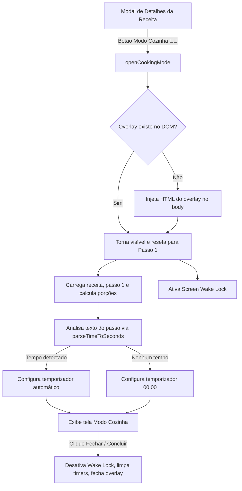

# Design Spec: Modo Cozinha com Temporizadores

**Data:** 2026-07-15 (Atualizado em 2026-08-03 para a Arquitetura Unificada)  
**Autor:** Antigravity (AI pair programmer)  
**Status:** Aprovado para Implementação  
**Projeto:** Chef Digital (Livro de Receitas & Planejador)

---

## 1. Visão Geral (Overview)

O **Modo Cozinha** é uma funcionalidade que transforma a visualização tradicional de uma receita em uma interface de tela cheia otimizada para o preparo ativo na cozinha. Com foco em usabilidade de mãos livres, tipografia em escala para visualização à distância, gaveta rápida de ingredientes e controle integrado de tempo (temporizadores), o objetivo é permitir que o usuário siga o passo a passo da receita com zero atrito de navegação.

---

## 2. Objetivos (Goals & Non-Goals)

### Objetivos (Goals)
* Apresentar o modo de preparo passo a passo em formato unitário (um passo por vez) com tipografia gigante.
* Detectar automaticamente menções de tempo de cozimento/espera no texto de cada passo via regex e sugerir um temporizador pronto para iniciar (suportando horas, minutos e segundos).
* Permitir ajustes manuais rápidos no temporizador (+1 min, +5 min, Pausar/Retomar, Zerar).
* Notificar o usuário visual e sonoramente (som dinâmico via Web Audio API) quando um temporizador for zerado.
* Manter a tela ativa no dispositivo usando a Screen Wake Lock API enquanto o Modo Cozinha estiver aberto.
* Oferecer uma gaveta recolhível para consulta rápida dos ingredientes escalados da receita sem sair do Modo Cozinha.
* Seguir estritamente a **Arquitetura Unificada** (`src/logic/` purificado e testado com Vitest, `src/modules/` para UI/DOM).

### Não-Objetivos (Non-Goals)
* Alterar o esquema ou os dados das receitas no Supabase ou IndexedDB.
* Adicionar suporte a múltiplos temporizadores concorrentes na mesma tela (apenas um temporizador por passo ativo).
* Adicionar controle de voz avançado nesta versão inicial.

---

## 3. Arquitetura e Fluxo de Integração

O Modo Cozinha é dividido em duas camadas de acordo com a Arquitetura Unificada do projeto:

1. **Camada de Lógica Pura (`src/logic/cooking-timer.js`)**:
   - Algoritmos de parsing com Regex (`parseTimeToSeconds`).
   - Gerenciamento de cálculo de tempo restante ajustado por timestamp real (`calculateRemainingTime`).
   - 100% testado de forma isolada via **Vitest** em `src/logic/cooking-timer.test.js`.

2. **Camada de Interface & DOM (`src/modules/cooking-mode.js`)**:
   - Criação e controle do overlay em tela cheia (`#cooking-mode-overlay`).
   - Ativação do Screen Wake Lock.
   - Síntese de áudio para alarme via Web Audio API.
   - Integração com `state` e navegação de passos.

### Fluxo de Funcionamento:

---

## 4. Especificação de Interface (UI) e Estilo (CSS)

A camada de interface é renderizada no container `#cooking-mode-overlay` no `<body>`.

### Layout dos Componentes:
* **Fundo:** Adapta-se ao tema ativo (`light` ou `dark` do atributo `data-theme` da página), usando cores neutras para máximo contraste.
* **Cabeçalho:** Botão "Sair do Modo Cozinha", título da receita e indicador do passo atual (ex: `Passo 2 de 5`).
* **Passo Ativo:** Exibido centralizado em tipografia serifada `Playfair Display`, peso 600, tamanho `2.2rem` (com ajuste responsivo) para fácil leitura à distância de 1 a 2 metros.
* **Painel do Temporizador:**
  * Mostrador numérico central de grande formato (`font-size: 3.5rem`, mono-espaçado).
  * Botões de Ação: `Iniciar / Pausar`, `+1 min`, `+5 min`, `Zerar`.
* **Navegação de Passos:**
  * Botões inferiores gigantes "Anterior" e "Próximo Passo / Concluir".
* **Gaveta de Ingredientes:**
  * Botão de alternância "📋 Ver Ingredientes" que abre um painel deslizante sobreposto com a lista de ingredientes escalados para a porção ativa.

---

## 5. Lógica de Negócio e Algoritmos (`src/logic/cooking-timer.js`)

### 5.1. Parsing de Tempo via Regex (`parseTimeToSeconds`)
O parser analisa a string do passo e converte para o total de segundos:

1. **Horas e Minutos Combinados:** Ex: `1 hora e 30 minutos` ou `2h e 15min`.
   * Regex: `/(\d+)\s*(?:horas?|h|hs)\s*(?:e\s*)?(\d+)\s*(?:minutos?|min|mins)/i`
2. **Faixas de Tempo:** Ex: `15 a 20 minutos`. Captura o valor máximo por segurança.
   * Regex: `/(\d+)\s*(?:a|ou|-)\s*(\d+)\s*(?:minutos?|min|mins)/i`
3. **Minutos simples:** Ex: `10 minutos`, `5 min`.
   * Regex: `/(\d+)\s*(?:minutos?|min|mins)\b/i`
4. **Horas simples:** Ex: `2 horas`, `1h`.
   * Regex: `/(\d+)\s*(?:horas?|h|hs)\b/i`
5. **Segundos simples:** Ex: `30 segundos`, `45s`.
   * Regex: `/(\d+)\s*(?:segundos?|seg|segs|s)\b/i`

### 5.2. Alarme Sonoro (Web Audio API)
Quando o temporizador atinge 0 segundos:
* Emissão de bipes eletrônicos via `AudioContext` nativo, com oscilador senoidal de `880Hz` e rampa de ganho (`GainNode`).
* Toca 3 bipes de 300ms a cada 3 segundos até que o usuário clique em "Silenciar" ou troque de passo.

### 5.3. Screen Wake Lock & Background Resilience
* Mantém o dispositivo ativo chamando a Screen Wake Lock API.
* Se a aba for minimizada ou o dispositivo for bloqueado temporariamente com o timer rodando, ao retornar a aplicação recalcula o tempo decorrido no mundo real usando a diferença de `Date.now()`.

---

## 6. Estratégia de Teste e Validação

1. **Testes Unitários da Lógica (`src/logic/cooking-timer.test.js`)**:
   - Validação do parser `parseTimeToSeconds` com diversos formatos de texto em pt-BR.
   - Validação do formatador `formatSecondsToMMSS`.
   - Validação do cálculo de tempo decorrido.
2. **Verificação de Lint & Build**:
   - `npm run test` (Vitest)
   - `npm run lint` (Oxlint)
   - `npm run build` (Vite)
