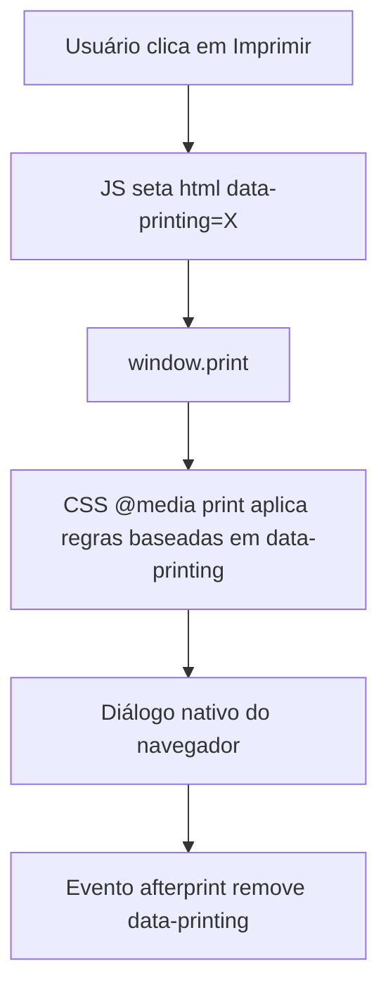

# Design Spec: Impressão de Receita, Lista de Compras e Menu Semanal

**Data:** 2026-07-27
**Autor:** GitHub Copilot CLI (pair programmer)
**Status:** Em Revisão
**Projeto:** Chef Digital (Livro de Receitas & Planejador)

---

## 1. Visão Geral (Overview)

Adiciona suporte a impressão para as três telas principais de consulta rápida do app: a receita individual (modal), a lista de compras e o menu semanal (planejador). O objetivo é permitir que o usuário leve a receita ou a lista para o papel na bancada, sem depender do celular/tablet ligado o tempo todo.

---

## 2. Objetivos (Goals & Non-Goals)

### Objetivos (Goals)
* Botão "🖨️ Imprimir" visível no modal de receita, no drawer de lista de compras e no drawer de planejador.
* Layout de impressão sempre em paleta clara (fundo branco, texto escuro), independente do tema ativo na tela (claro ou escuro), para economizar tinta e manter legibilidade no papel.
* Reaproveitar o DOM já renderizado por cada tela (sem duplicar templates de HTML/lógica de renderização).
* Ingredientes da receita impressos na quantidade correspondente ao multiplicador de porções selecionado no momento (ex: `2x`).
* Foto da receita (quando existir) incluída na impressão, além do emoji.
* Lista de compras impressa com todos os grupos presentes (receitas avulsas + "Menu Semanal Consolidado"), preservando o estado `checked` de cada item.
* Menu semanal impresso como lista simples de receitas planejadas + porções (sem atribuição de dia da semana, que está fora de escopo desta spec).
* Esconder da impressão todo elemento de ação/navegação que não faz sentido no papel (botões de fechar, favoritar, planejar, +/- de porção, lixeira, copiar lista, etc.).
* Manter compatibilidade total com execução offline e o protocolo local `file://`.

### Não-Objetivos (Non-Goals)
* Não introduz atribuição de dia da semana ao planejador (ex: Segunda, Terça...).
* Não gera PDF nem usa bibliotecas externas de impressão — depende exclusivamente do diálogo nativo de impressão do navegador (`window.print()`).
* Não cria uma janela/aba separada com HTML duplicado (ver seção 3 sobre a abordagem escolhida).
* Não altera o schema de dados em `receitas.js`.

---

## 3. Arquitetura e Fluxo de Integração

A abordagem escolhida é **CSS de impressão "in-place"**: reaproveita o DOM já existente de cada tela (modal ou drawer), sem gerar HTML novo em uma janela separada. Um atributo de estado no elemento raiz da página controla, via `@media print`, qual container fica visível durante a impressão.

### Fluxo de Funcionamento


### Funções JS novas (em `index.html`)
* `printRecipe()` — seta `document.documentElement.dataset.printing = 'recipe'` e chama `window.print()`.
* `printShoppingList()` — seta `dataset.printing = 'shopping'` e chama `window.print()`.
* `printPlanner()` — seta `dataset.printing = 'planner'` e chama `window.print()`.
* Um listener único, registrado uma vez: `window.addEventListener('afterprint', () => { delete document.documentElement.dataset.printing; })`. Cobre tanto a impressão efetivada quanto o cancelamento do diálogo (o navegador dispara `afterprint` em ambos os casos).

Nenhuma nova função de renderização é criada: o conteúdo impresso é o mesmo DOM já populado por `openRecipeModal()`, `renderShoppingList()` e `renderPlanner()`.

---

## 4. Especificação de Interface (UI) e Estilo (CSS)

### 4.1. Botões novos
Um botão `.print-btn` (rótulo "🖨️ Imprimir", com ícone SVG de impressora) é adicionado em:
* `modal-actions-wrapper` do modal de receita (ao lado dos botões de planejar/adicionar à lista), chamando `printRecipe()`.
* Cabeçalho ou rodapé do `shopping-list-drawer`, chamando `printShoppingList()`.
* Cabeçalho ou rodapé do `planner-drawer`, chamando `printPlanner()`.

### 4.2. Bloco `@media print` (novo, ao final de `estilos.css`)

```css
@media print {
  /* 1. Esconde tudo por padrão */
  body * { visibility: hidden; }

  /* 2. Torna visível apenas o container do alvo ativo + seus filhos */
  html[data-printing="recipe"] #recipe-modal,
  html[data-printing="recipe"] #recipe-modal *,
  html[data-printing="shopping"] #shopping-list-drawer,
  html[data-printing="shopping"] #shopping-list-drawer *,
  html[data-printing="planner"] #planner-drawer,
  html[data-printing="planner"] #planner-drawer * {
    visibility: visible;
  }

  /* 3. Reposiciona o alvo ativo na origem da página (estava fixed/transform p/ animação) */
  html[data-printing] #recipe-modal,
  html[data-printing] .drawer {
    position: static !important;
    transform: none !important;
    overflow: visible !important;
    height: auto !important;
    width: 100% !important;
    box-shadow: none !important;
  }

  /* 4. Força paleta clara (sobrescreve variáveis do tema escuro) */
  html[data-printing] {
    --neutral-bg: #ffffff;
    --neutral-card: #ffffff;
    --text-main: #000000;
    --text-muted: #333333;
    --neutral-border: #cccccc;
  }

  /* 5. Esconde elementos de ação/navegação que não fazem sentido no papel */
  html[data-printing] .modal-close-btn,
  html[data-printing] .btn-modal-action,
  html[data-printing] .portion-btn,
  html[data-printing] .card-action-btn,
  html[data-printing] .drawer-card-remove,
  html[data-printing] .print-btn,
  html[data-printing] .drawer-footer,
  html[data-printing] #drawer-backdrop {
    display: none !important;
  }

  /* 6. Evita cortar cards/grupos ao meio da página */
  html[data-printing] .shopping-section,
  html[data-printing] .drawer-card,
  html[data-printing] .modal-ingredients-li,
  html[data-printing] .modal-step-li {
    break-inside: avoid;
  }
}
```

### 4.3. Conteúdo por tela

| Tela | O que aparece impresso | O que some |
|---|---|---|
| **Receita** | Título, categoria(s), foto (se houver) + emoji, badge de porções (ex: `2x`), lista de ingredientes com checkbox na quantidade escalada, modo de preparo numerado, caixa de dica (se houver) | Botão de fechar, botões de ação (planejar/adicionar à lista/imprimir), botões `+`/`-` de porção (mantém só o texto `2x`) |
| **Lista de compras** | Todos os grupos presentes (avulsos + "Menu Semanal Consolidado"), nome + quantidade formatada, checkbox refletindo o `checked` atual | Botões de lixeira por grupo, "copiar lista", "limpar tudo", botão de imprimir |
| **Menu semanal** | Lista de receitas planejadas: emoji, título, porções (ex: `2x`) | Botões `+`/`-` de porção, botão de remover, botão "Consolidar Lista de Compras", botão de imprimir |

O checkbox de ingrediente (`.ing-checkbox`), normalmente um `<div>` clicável, permanece visualmente como quadradinho (☐/☑) via CSS já existente — não precisa de tratamento especial além de esconder o cursor/hover.

---

## 5. Casos de Borda (Edge Cases)

* **Lista de compras ou planejador vazios:** exibe o mesmo `drawer-empty-state` já usado na tela (ex: "Sua lista está vazia!"), sem erro.
* **Cancelamento do diálogo de impressão:** o navegador dispara `afterprint` tanto ao confirmar quanto ao cancelar, então `data-printing` é sempre limpo corretamente.
* **Paginação de listas longas:** resolvida via `break-inside: avoid` nos cards/itens (seção 4.2, regra 6), evitando cortes no meio de um grupo ou ingrediente.
* **Modo escuro ativo:** a sobrescrita de variáveis de cor vale somente dentro de `[data-printing]`; a tela em si continua no tema escolhido pelo usuário.
* **Receita sem foto ou sem dica:** os blocos correspondentes (`hasImg`, `tips`) já não são renderizados pela lógica atual — nada extra a fazer na impressão.

---

## 6. Estratégia de Teste e Validação

Testes manuais (o projeto não possui test runner automatizado):

1. Abrir uma receita com foto, ajustar porções para `3x`, clicar em Imprimir → na pré-visualização, confirmar foto, quantidades escaladas, checkboxes visíveis e ausência de botões de ação.
2. Repetir com uma receita sem foto e sem dica → confirmar que não sobra espaço em branco/quebrado onde a foto/dica estariam.
3. Adicionar 2 receitas avulsas à lista de compras, planejar e consolidar 2 receitas no menu semanal, marcar 1 item de cada grupo como comprado, imprimir a lista → confirmar todos os grupos presentes com checkboxes corretos e sem botões de lixeira/copiar/limpar.
4. Planejar 3 receitas, imprimir o menu semanal → confirmar lista de títulos + porções, sem botões de ação.
5. Repetir os testes acima com o tema escuro ativo → confirmar que a pré-visualização de impressão é sempre clara.
6. Testar com lista de compras e planejador vazios → confirmar estado vazio sem erros no console.
7. Testar a pré-visualização de impressão abrindo `index.html` diretamente via `file://` (sem servidor), para garantir compatibilidade offline total.

---

## 7. Estratégia de Rollback

As alterações se limitam a: três novas funções JS pequenas e independentes (`printRecipe`, `printShoppingList`, `printPlanner`) mais um listener de `afterprint`, três botões novos no HTML, e um bloco `@media print` isolado ao final de `estilos.css`. Nenhum dado em `localStorage` ou em `receitas.js` é afetado. Em caso de problema, a reversão é feita via Git revertendo o commit da feature.
