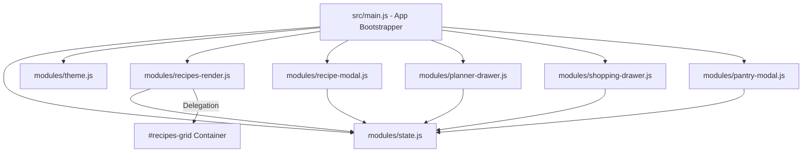

# Especificação de Design - Fase 2: Refatoração da Arquitetura e Performance

> **Data:** 2026-08-02  
> **Status:** Em Revisão  
> **Projeto:** Chef Digital (PWA)

---

## 1. Visão Geral e Objetivos

O objetivo principal desta fase é desacoplar o arquivo monólito [src/main.js](file:///C:/Sistemas/Projetos/receitas/src/main.js) (atualmente com ~1.600 linhas) em uma arquitetura modular por domínio e otimizar a performance de renderização no DOM do PWA.

### Metas:
1. **Modularização por Domínio**: Dividir `src/main.js` em módulos ES organizados por funcionalidade em `src/modules/`.
2. **Event Delegation**: Substituir listeners inline/individuais nos cards de receita por um único manipulador centralizado no container `#recipes-grid` (reduzindo uso de memória e prevenindo event leaks).
3. **Renderização Eficiente**: Chunking de renderização para grandes listas e recuperação de scroll state.
4. **Manutenibilidade e Testabilidade**: Permitir testar e modificar cada domínio isoladamente sem regressões no restante do app.

---

## 2. Estrutura de Arquivos Proposta

```
src/
├── cache.js                 (IndexedDB e Fila Offline - Mantido)
├── supabase.js              (Cliente Supabase - Mantido)
├── main.js                  (Ponto de entrada: inicialização e orquestração)
└── modules/
    ├── state.js             (Estado reativo centralizado: recipes, favorites, shopping, planned)
    ├── theme.js             (Gestão de tema claro/escuro)
    ├── recipes-render.js    (Renderização de cards, categorias, filtros e event delegation)
    ├── recipe-modal.js      (Modal de detalhes da receita, porções e Wake Lock)
    ├── planner-drawer.js    (Gaveta do planejador semanal e exportação/impressão)
    ├── shopping-drawer.js   (Gaveta da lista de compras consolidada)
    └── pantry-modal.js      (Modal de despensa/estoque de ingredientes)
```

---

## 3. Arquitetura dos Módulos



### 3.1 Módulo `modules/state.js`
Mantém e exporta a fonte da verdade do estado da aplicação:
- `recipes`, `categories`, `favorites`, `shoppingList`, `plannedByDay`, `pantryItems`, `activeCategory`, `searchQuery`.
- Métodos utilitários de mutação limpa de estado.

### 3.2 Módulo `modules/recipes-render.js` & Event Delegation
- Centraliza a renderização de cards e filtros de categoria.
- Registra **um único listener `click`** no elemento `#recipes-grid`:
  - Captura ações pelo `data-action` (ex: `data-action="toggle-favorite"`, `data-action="open-modal"`, `data-action="open-day-picker"`).
  - Elimina chamadas inline e reduz drásticamente a alocação de memória ao filtrar centenas de receitas.

### 3.3 Módulos de Componentes (Modal, Drawers e Pantry)
- Cada arquivo cuida exclusivamente da sua interface, animações CSS de drawer/modal e ações de persistência associadas.

---

## 4. Plano de Testes e Verificação

- **Sintaxe & Compilação**: Todos os novos módulos ES serão validados via `node --check` e `npx vite build`.
- **Compatibilidade Global**: Garantir que as funções necessárias para o HTML inline continuem mapeadas em `window.*` sem regressões.
- **Teste de Performance**: Comparar a alocação de memória durante a busca/filtragem com Event Delegation vs. versão anterior.

---

## 5. Próximos Passos
Após aprovação desta especificação, criaremos o plano de implementação detalhado (`docs/superpowers/plans/2026-08-02-fase-2-refatoracao.md`) e executaremos as tarefas via *subagent-driven development*.
