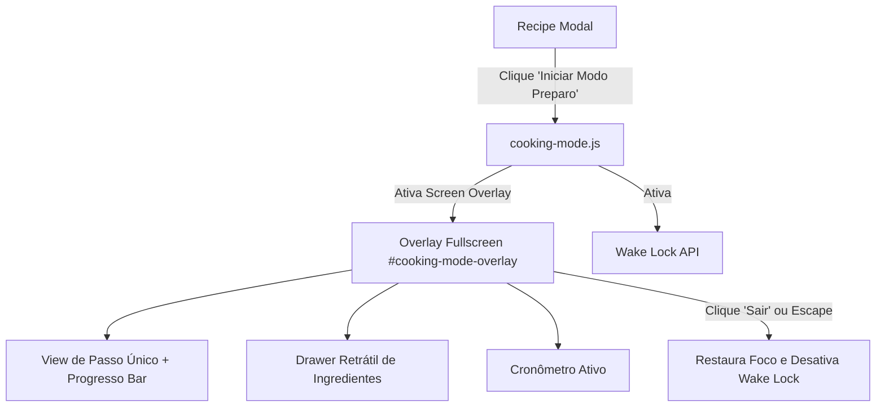

# Especificação de Design - Fase 3: Modo Preparo (Cooking Mode) & Otimizações de UX

> **Data:** 2026-08-03  
> **Status:** Em Revisão  
> **Projeto:** Chef Digital (PWA)

---

## 1. Visão Geral e Objetivos

O **Modo Preparo (Cooking Mode)** é uma experiência imersiva em tela cheia projetada para auxiliar a pessoa usuária durante o ato de cozinhar na cozinha. 

### Objetivos Principais:
1. **Interface Focada (Full-Screen Imersivo)**: Apresentar um passo por vez com tipografia grande e legível à distância.
2. **Wake Lock Nativo**: Manter a tela do celular/tablet acesa enquanto o modo estiver ativo.
3. **Navegação por Passos**: Permitir avançar/retroceder via botões visíveis, gestos de swipe e setas do teclado.
4. **Timers Inteligentes**: Detectar automaticamente referências de tempo nos textos dos passos (ex: "cozinhe por 10 minutos" ou "deixe descansar por 1 hora") e oferecer cronômetros acionáveis de 1 toque.
5. **Painel Retrátil de Ingredientes**: Permitir consultar as quantidades dos ingredientes da receita sem sair da tela de preparo.

---

## 2. Estrutura de Arquivos e Módulos

```
src/
└── modules/
    └── cooking-mode.js   (Gestão da UI de tela cheia, navegação, timers e Wake Lock)
```

### Integração nos Módulos Existentes:
- `src/modules/recipe-modal.js`: Adicionar botão de "Iniciar Modo Preparo" no modal da receita.
- `src/main.js`: Expor manipuladores de atalho do Modo Preparo e integrar no listener global de teclado (`Escape`, setas `Left`/`Right`).

---

## 3. Fluxo de Usuário e Arquitetura



---

## 4. Detalhes de Funcionalidades e UI

### 4.1 Interface e Animações
- **Header**: Botão de fechar (X), título da receita e barra de progresso (ex: "Passo 2 de 5 - 40%").
- **Card Central**: Texto do passo atual com destaque tipográfico (font-size escalado), acompanhado de contador visual.
- **Footer**: 
  - Botão "Passo Anterior" / "Próximo Passo".
  - Botão retrátil "Ver Ingredientes".
  - Seção de Timers rápidos se houver tempo detectado no passo.

### 4.2 Detecção Automática de Timers
- Regex para parsing de strings no texto do passo: `(\d+)\s*(min|minuto|minutos|h|hora|horas)`.
- Ao detectar um tempo, renderiza um badge/botão: `⏱ Iniciar Timer (15 min)`.
- Notificação sonoro-visual ao atingir 00:00.

---

## 5. Plano de Verificação e Testes

- **Compilação Vite**: Rodar `npx vite build` para validar integração limpa do módulo.
- **Teste de Teclado & Gestos**: Verificar se a navegação por teclas (`ArrowRight`, `ArrowLeft`, `Escape`) responde adequadamente.
- **Acessibilidade**: Garantir foco aprisionado (`focus trap`) no overlay durante a sessão de preparo.

---

## 6. Próximos Passos
Após aprovação desta especificação, criaremos o plano de implementação e executaremos as tarefas.
